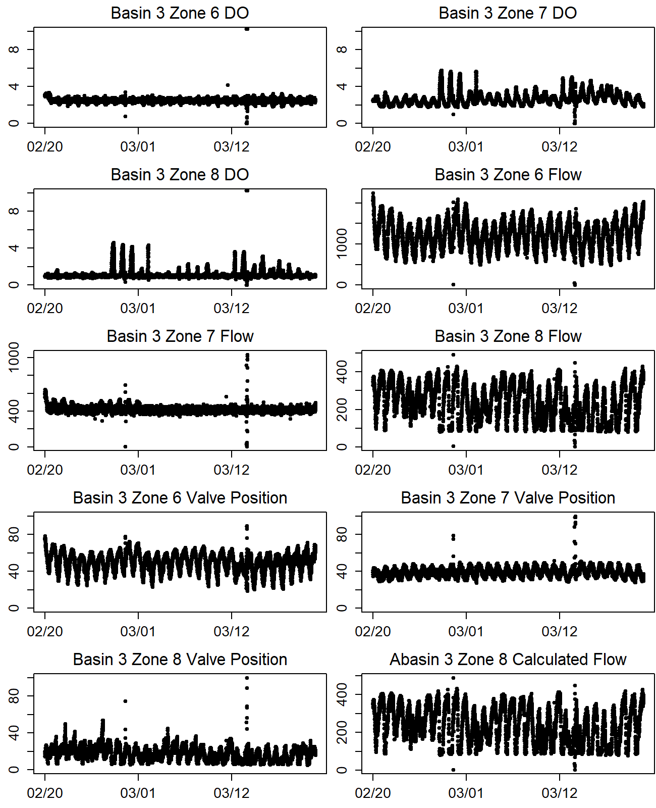
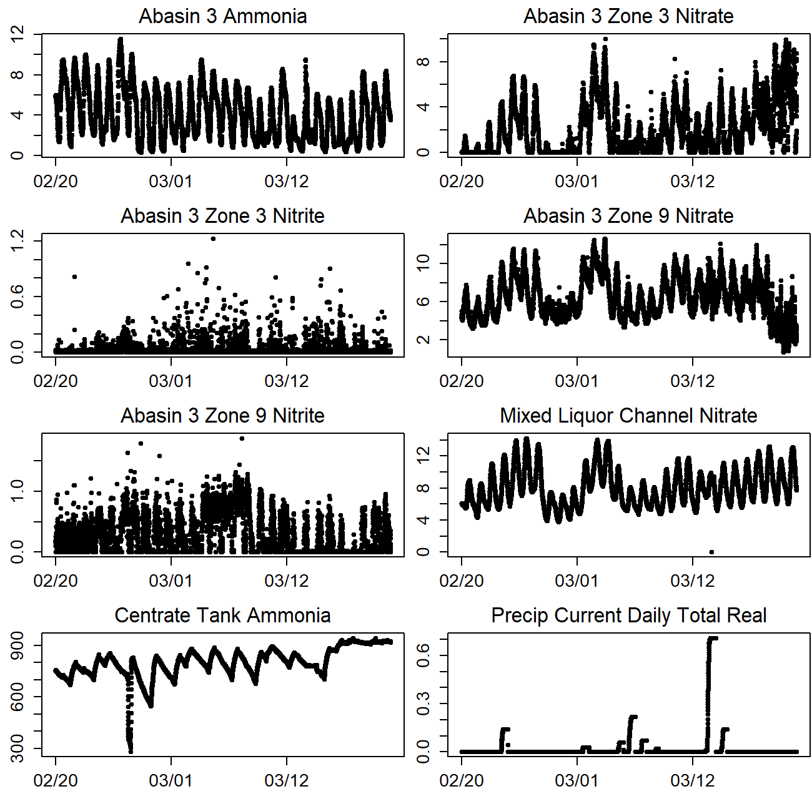
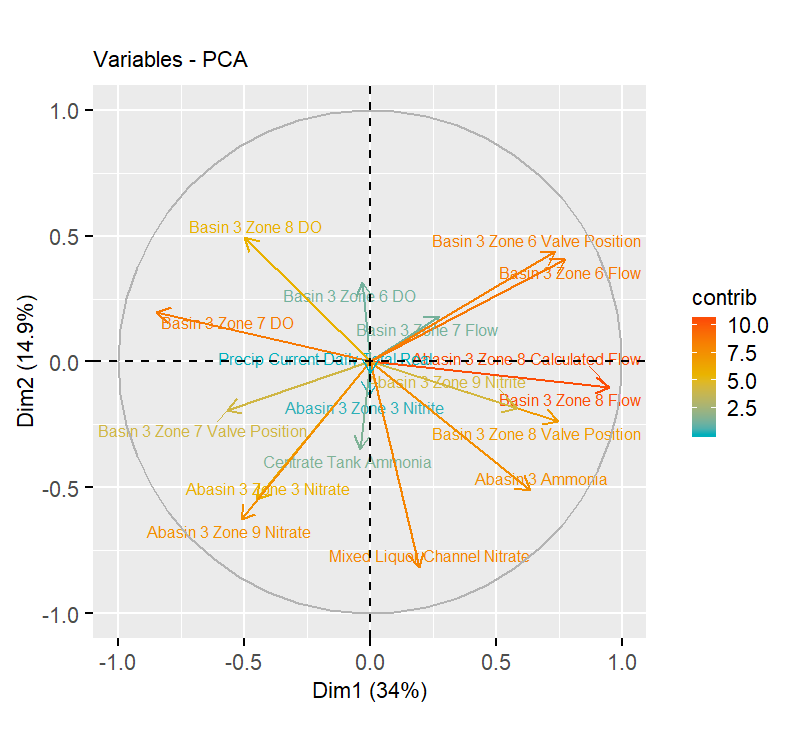
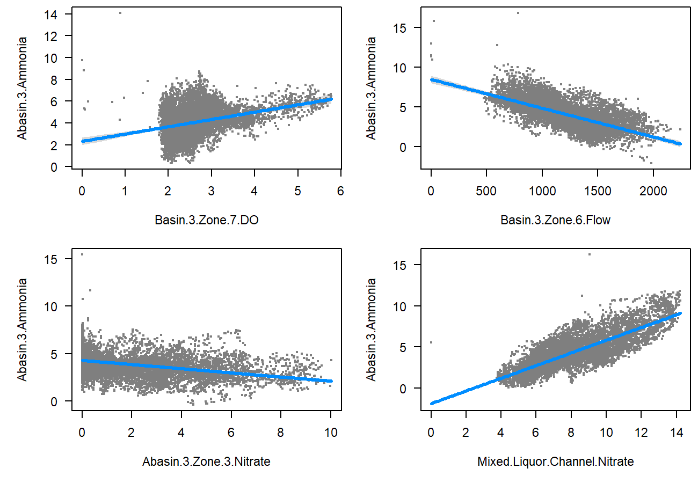
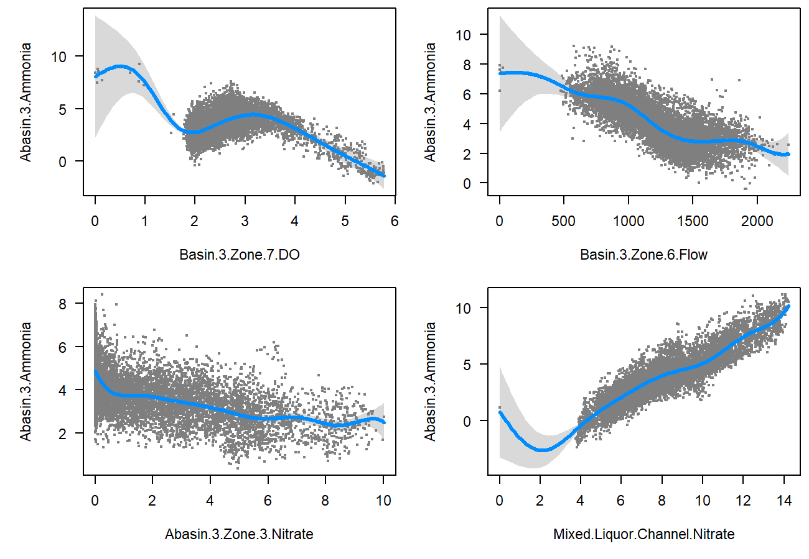
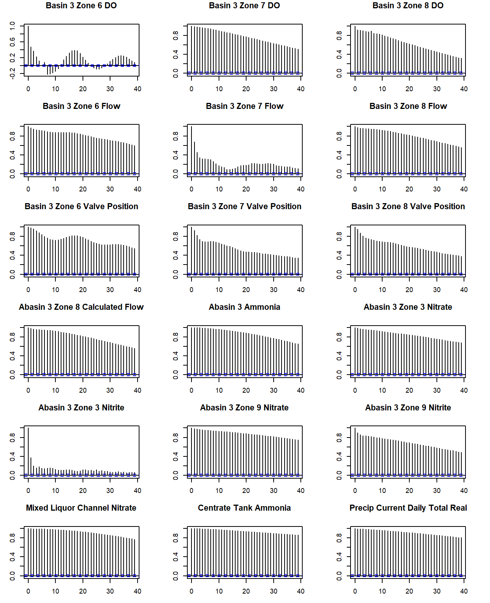

```{r Preliminary Settings, message=FALSE, warning=FALSE, include=FALSE, paged.print=FALSE}
rm(list=ls())

default.par <- par()

# Load required packages
packageLoad <- function(packName){ #packName - package name as a character string, e.g. "quantmod"
  if(!require(packName,character.only = TRUE)){ #If the package is not available, install it
    install.packages(packName,dependencies=TRUE,repos="http://cran.r-project.org")
  }
  library(packName, character.only = TRUE) # load package
}

sapply(c("xts", "readxl", "factoextra"), function(x) packageLoad(x))

is.integer0 <- function(x) {is.integer(x) && length(x) == 0L}

# Plot timeseries
plotTimeseries <- function(data1) {

label1 <- colnames(data1)

r1 <- range(index(data1)[which(!is.na(data1))])[1]
r2 <- range(index(data1)[which(!is.na(data1))])[2]

data2plot <- na.omit(data1)[paste0(r1,"/",r2)]
data2plot <- data.frame(as.numeric(data2plot), row.names = as.character(index(data2plot)))

# Specific to LIFT 2019
do.not.plot <- which(data2plot[,1] == "Bad")
if(!is.integer0(do.not.plot)) {data2plot <- data2plot[-do.not.plot,]}
y.lim <- if(!is.integer0(grep("DO", label1, value = FALSE))){c(0,10)} else {
       if(!is.integer0(grep("Valve Position", label1, value=FALSE))){c(0,100)} else {
         c(min(na.omit(data2plot[,1])), max(na.omit(data2plot[,1])))}}

data2plot <- cbind(data2plot, as.numeric(difftime(as.POSIXct(rownames(data2plot)), as.POSIXct(rownames(data2plot)[1]),units = "days")))

  
par(mar=c(2.6,2.6,2.1,0.1), cex.axis = 1.25)
plot(x = data2plot[,ncol(data2plot)], y = data2plot[,1], type = "p", pch = 20, col = "black", xaxt = "n", xlab = "", ylab = "", ylim = y.lim)
mtext(side = 3, label1, line = .5)

# x-axis
axis.ticks <- seq(0,round(data2plot[nrow(data2plot),ncol(data2plot)]), by = 10)
axis.labels <- sapply(axis.ticks, function(x) which(x > data2plot[,ncol(data2plot)]))
axis.labels <- sapply(axis.labels, function(x) x[length(x)])
axis.labels[[1]] <- 1
axis.labels <- as.numeric(unlist(axis.labels))
axis(side = 1, at = axis.ticks, labels = format(as.POSIXct(rownames(data2plot)[axis.labels]), "%m/%d"))
}
```


```{r Import Data, message=FALSE, warning=FALSE, include=FALSE, paged.print=FALSE}
SCADA.data <- read_excel("data/Copy of Basin 3_5m SCADA Data_Jan-Mar 21 2019_LIFT 2019.xlsx")
SCADA.data <- xts(data.frame(SCADA.data[-which(is.na(SCADA.data[,1][[1]])),-1]), order.by = as.POSIXct(SCADA.data[-which(is.na(SCADA.data[,1][[1]])),1][[1]]))
org.range <- range(index(SCADA.data))
constant.vars <- c("BASIN.3.ZONE.9.DO", "BASIN.3.ZONE.9.FLOW",
                   "ABASIN.3..MIXING.ZONE.1.ORP", "ABASIN.3.MIXER.1.RUNTIME",
                   "ABASIN.3.MIXER.2.RUNTIME", "ABASIN.3.MIXER.3.RUNTIME",
                   "ABASIN.3.MIXER.4.RUNTIME..F_CV.", "ABASIN.3.MIXER.5.RUNTIME..F_CV.",
                   "ABASIN.3.IMLR.PUMP.1.RUNNING..F_CV.", "ABASIN.3.IMLR.PUMP.2.RUNNING..F_CV.",
                   "ABASIN.3.IMLR.PUMP.3.RUNNING..F_CV.", "ABASIN.3.MIXER.1.RUNNING..F_CV.",
                   "ABASIN.3.MIXER.2.RUNNING..F_CV.", "ABASIN.3.MIXER.3.RUNNING..F_CV.",
                   "ABASIN.3.MIXER.4.RUNNING..F_CV.","ABASIN.3.MIXER.5.RUNNING..F_CV.",
                   "MIXED.LIQUOR.CHANNEL.pH..RAW..F_CV.", "PLANT.INFLUENT.FLOW", 
                   "PLANT.INFLUENT.PH", "INFLUENT.H20.TEMPERATURE..REAL.",
                   "CENTRATE.PUMP..1.RUN.STATUS", "CENTRATE.PUMP..2.RUN.STATUS", 
                   "MIXED.LIQUOR.CHANNEL.pH..ACTUAL", "PAD.AIR.FLOW..F_CV.", 
                   "ABASIN.3.ZONE.9.VALVE.POSITION")
SCADA.data <- SCADA.data[,-which(colnames(SCADA.data) %in% constant.vars)]["2019-02-20/2019-03-20"]

capwords <- function(s, strict = FALSE) {
    cap <- function(s) paste(toupper(substring(s, 1, 1)),
                  {s <- substring(s, 2); if(strict) tolower(s) else s},
                             sep = "", collapse = " " )
    sapply(strsplit(s, split = " "), cap, USE.NAMES = !is.null(names(s)))
}
SCADA.data.names <- as.character(sapply(stringr::str_replace_all(colnames(SCADA.data), c("[.][.]" = " ", "[.]" = " ", "_" = " ")), function(x) capwords(casefold(x, upper = FALSE))))
SCADA.data.names <- stringr::str_replace_all(SCADA.data.names, "Do", "DO")
colnames(SCADA.data) <- SCADA.data.names
```

```{r Plot Timeseries, message=FALSE, warning=FALSE, include=FALSE, paged.print=FALSE}
n <- round(ncol(SCADA.data)/2)
n <- if(n %% 2 == 1){n+1}

png("images/LIFT_2019_timeseries_01.png", units = "in", width = 6.5, height = 8/5*(n/2), res = 200)
par(mfrow=c((n/2),2))
sapply(SCADA.data[,1:n], function(x) plotTimeseries(x))
dev.off()

png("images/LIFT_2019_timeseries_02.png", units = "in", width = 6.5, height = 8/5*((n/2)-1), res = 200)
par(mfrow=c(((n/2)-1),2))
sapply(SCADA.data[,(n+1):ncol(SCADA.data)], function(x) plotTimeseries(x))
dev.off()
```

```{r Plot PCA, message=FALSE, warning=FALSE, include=FALSE, paged.print=FALSE}
par(default.par)

rows.2.remove <- do.call(c, sapply(SCADA.data, function(x) which(x == "Bad")))
SCADA.data.clean <- na.omit(apply(SCADA.data[-rows.2.remove,], MARGIN = 2, function(x) as.numeric(x)))
pca.results <- prcomp(SCADA.data.clean, scale=TRUE)

png("images/LIFT_2019_pca_01.png", units = "in", res = 200, width = 4, height = 3.75, family="A", pointsize=6)
fviz_pca_var(pca.results, labelsize = 2,
             col.var = "contrib",
             gradient.cols = c("#00AFBB", "#E7B800", "#FC4E07"),
             repel = TRUE,
             ggtheme=theme(axis.text=element_text(size=8), 
                           axis.title=element_text(size=8),
                           plot.title=element_text(size=8),
                           legend.title=element_text(size=8),
                           legend.text=element_text(size=8)
             ))
dev.off()
```


```{r eval=FALSE, message=FALSE, warning=FALSE, include=FALSE, paged.print=FALSE}
data <- data.frame(SCADA.data.clean)
fmla <- as.formula(paste0(colnames(data)[11],"~", paste(colnames(data)[c(1:10,12:length(colnames(data)))], collapse= "+")))
glm.model <- glm(fmla, data=data)
png("images/LIFT_2019_glm_01.png", units = "in", res = 200, width = 6.5, height = 2*2.25, family="A", pointsize = 10)
par(mar=c(5,5,.5,.5), mfrow=c(2,2))
sapply(colnames(data)[c(2, 4,12, 16)], function(x) visreg::visreg(glm.model, x, ylab=colnames(data)[11]))
dev.off()
# visreg::visreg(glm.model)
```

```{r eval=FALSE, message=FALSE, warning=FALSE, include=FALSE, paged.print=FALSE}
data <- data.frame(SCADA.data.clean)
fmla.predict <- paste0("s(",colnames(data)[c(1:10,12:length(colnames(data)))],", bs='ps', sp=0.6)", collapse="+")
fmla <- as.formula(paste0(colnames(data)[11],"~", fmla.predict))
gam.model <- mgcv::gam(fmla, data=data)
png("images/LIFT_2019_gam_01.png", units = "in", res = 200, width = 6.5, height = 2*2.25, family="A", pointsize = 10)
par(mar=c(5,5,.5,.5), mfrow=c(2,2))
sapply(colnames(data)[c(2, 4,12, 16)], function(x) visreg::visreg(gam.model, x, ylab=colnames(data)[11]))
dev.off()
# visreg::visreg(gam.model)
```


```{r eval=FALSE, include=FALSE}
acf.results <- apply(SCADA.data.clean, MARGIN = 2, function(x) acf(x))
png("images/LIFT_2019_acf_01.png", units = "in", res = 200, width = 6.5, height = 8, family="A", pointsize = 10)
par(mfrow=c(length(acf.results)/3,3), mar=c(3,3,3,3))
for (i in 1:length(acf.results)) {
  plot(acf.results[[i]], main=SCADA.data.names[i])
}
dev.off()

ammonia.col <- which(colnames(SCADA.data.clean) == "Abasin 3 Ammonia")
acf.results <- apply(SCADA.data.clean[,-ammonia.col], MARGIN = 2, function(x) acf(c(SCADA.data.clean[,ammonia.col],x)))
# png("images/LIFT_2019_acf_02.png", units = "in", res = 200, width = 6.5, height = 8, family="A", pointsize = 10)
par(mfrow=c(length(acf.results)/3,3), mar=c(3,3,3,3))
for (i in 1:length(acf.results)) {
  plot(acf.results[[i]]
}
dev.off()
```


For data-driven analysis, a *clean* dataset is required to appropriately train a model in order to (i) identify relationships between variabels and (ii) define in-control and out-of-control conditions. The first step in data cleaning is the visual inspection of timeseries plots. Wastewater treatment data provided by City of Boulder, Colorado is plotted in Figure 1, minus process variables that did not change (e.g., variables from Zone 9) or did not have numerical data (e.g., influent flow) throughout the window of time provided (`r as.Date(org.range)`). However, a shift in flows at the end of February led to subsetting data to `r as.Date(range(index(SCADA.data)))`. Is it okay to subset to this range? Or do we want to predict under February's conditions as well?


Principal component analysis (PCA) shows that the majority of the variation present in the data is governed by flow and dissolved oxygen (DO). Which variable from the list are we most interested in predicting?


A strict linear model (LM) requires that the response variable follows the normal distribution whilst the generalized linear model (GLM) is an extension of the LM that allows the for models whose response variable follows different distributions. Generalized additive models (GAM) is an additive modeling technique where the impact of the predictive variables is captured through smooth functions which-depending on the underlying patterns in the data-can be nonlinear. Variables that appeared to trend with `r SCADA.data.names[11]` are in Figures 3 and 4. 

Figure 5 includes autocorrelation functions to visually identify the best lag. 

<div custom-style="FigureCenter">


</div>
**Figure 1.** Process data from the City of Boulder, Colorado municipal wastewater treatment facility. 

<div custom-style="FigureCenter">

</div>
**Figure 2.** Principal component analysis of process data from the City of Boulder, Colorado municipal wastewater treatment facility between `r as.Date(range(index(SCADA.data)))`.

**Table 1.** PCA variable contributions to City of Boulder, Colorado municipal wastewater treatment facility
```{r eval=FALSE, message=FALSE, warning=FALSE, include=FALSE, paged.print=FALSE}
pca.results.summary <- factoextra::get_pca_var(pca.results)
pca.results.contrib <- pca.results.summary$contrib
knitr::kable(pca.results.contrib[order(-pca.results.contrib[,1]),1:6], digits = 1)
```


<div custom-style="FigureCenter">

</div>
**Figure 3.** GLM model for predicting `r SCADA.data.names[11]`.


<div custom-style="FigureCenter">

</div>
**Figure 4.** GAM model for predicting `r SCADA.data.names[11]`.


<div custom-style="FigureCenter">

</div>
**Figure 5.** Autocorrelation plots of process variables