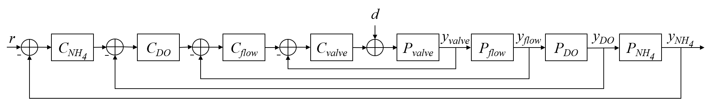
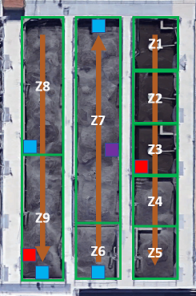

```{r global_options, include=FALSE}
knitr::opts_chunk$set(fig.path="figures/", fig.align="center", fig.fullwidth=TRUE, fig.width=6.5, dpi=300,
                      echo=FALSE, warning=FALSE, message=FALSE)
    # 
```
`r fig<-0;tab<-0`

##### Page break
# Introduction 

One of the greatest and costliest threats to surface waterways in the United States is nutrient pollution (Environmental Protection Agency) 2011). The removal of nitrogen and phosphorus from water at municipal wastewater treatment plants (WWTP) is necessary to address the growing environmental challenge. As states implement increasingly stringint nutrient limits on WWTP, the cost of has wastewater treatment increased substancially. Biological nutrient removal is acheived by introducing dissolved oxygen (DO) via industrial air blowers, which is one of the largest operating costs for WWTP. Conventionally, air blower output is increased or decreased relative to the measured concentration of DO in an aeration basin to maintain a DO setpoint where nitrogen removal is effectively guarenteed. While this approach ensures treatment, there are multiple drawback. DO control  is energy inefficient as aeration is provided whether ammonia is present or absent; conventional control leads to large fluctuations in air demand to maintain a single DO setpoint, which mechanically stresses the air blowers; and microbial communities responsible for treatment are stressed with large and rapid DO fluctuations. Currently, WWTP operators rely on trial-and-error to identify a DO setpoint that treats water to an ammonia concentration well below the permited limit. Such a  large factor of safety is required to ensure that under the highest flow and load conditions, water will be fully treated and the WWTP will not exceed their nutrient limits. To save energy and reduce excessive use of air blowers at WWTP, a new aeration paradigm is needed.

Ammonia-based aeration control (ABAC) is an aeration approach which responds to water quality changes in real-time by adjusting air flow to meet an ammonia setpoint instead of a DO setpoint. ABAC can limit excessive aeration promoting full nitrogen removal, potentially improving phosphorus removal, and reducing effluent ammonia peaks (Rieger et al. 2012). The most popular ABAC configuration utilizes a microbial kinetics model to calculate the aeration demand given a variety of operating parameters such as solids retention time and influent ammonia concentration (Duffy et al. 2010). This feedforward approach can reduce aeration demand, but requires extensive sampling and specialized knowledge for accurate model calibration and implementation. A feedback ABAC option would not require a kinetic model and could adjust DO setpoints from an ammonia sensor in the aeration basin where treatment takes place. However, WWTP operators are hesitent to adopt ABAC due to the instability of the sensors involved in feedback ABAC (specifically ion-selective electrodes) and the potential for the growth of microorganisms that inhibit settling in subsequent treatment at lower DO concentrations (i.e., filamentous bacteria). A third ABAC approach could incorporate statistical process models to predict ammonia in a feedback or feedforward configuration. The advantages of forecasting using statistical and machine learning models is (a) no additional sampling, microbiological analysis, or proprietary software is required to build the model and (b) the forecast can easily replace the current measured value of ammonia in the supervisory control and data acquisition (SCADA) system of the WWTP–which lacks advanced control schema. Existing hurdles to implementation of data-driven systems in WWTP include knowledge and experience. To date, there are only a handful of WWTP in and outside of the U.S. who have implemented model predictive control systems in their facilities.

The goal of this work is (1) to demonstrate the stability of a feedback ABAC configuration for WWTP operators and (2) to explore simple, data-driven methods of forecasting ammonia to overcome the lag associated with conventional feedback control to improve accuracy and reduce mechanical wear of aeration systems. Four different cascade control aeration configurations are tested and compared from a medium-sized WWTP to identify the most robust aeration control to balance treatment of ammonia with energy consumption. The manuscript is organized as follows: (1) an introduction to control systems in WWTP, (2) summary of methods for quantifying variation in multivariate systems, (3) summary of staistical and machine learning methods used to build the ammonia forecasting models, and (4) an assessment of how forecasting models can improve conventional control in WWTP.

## Control in wastewater treatment

WWTP are similar to other industrial processes in that select monitored system parameters need to be within a set range for the system to operate properly. Unlike many industrial processes, municipal WWTP have little control over the quantity and quality of the inputs to their system but are required by law to maintain a certain quality of the output. Due to the wide variation, manual adjustments of an open-loop control system (i.e., constant control output regardless of system conditions) cannot constantly achieve the level of treatment needed; frequently under-treating during peak flows and potentially exceeding regulated quality limits, and over-treating during low flows which wastes energy and other material inputs. Therefore, a flexible and responsive control system is required to maintain effluent water quality while minimizing energy and chemical input.

The most common control structure is feedback control in industrial automation. Feedback control determines a control action from a process measurement within the system (i.e., closed-loop control), and is able to automatically respond to system disturbances without specific knowledge of how the control and response parameters are related. The Proprotional-Integral-Derivative (PID) controller is the most common feedback controller due to its simplicity and robustness to respond to a deviation from desired conditions (i.e., error $e(t)$). A PID control action is the sum of: a proportional term ($K_p(e(t))$) where $K_p$ is a constant value; a integral term ($K_i \int_{0}^{t} e(\tau) d\tau$) and incorporates past control error with the integral function; and a derivative term ($K_d \frac{de(t)}{dt}$) which anticipates future error with the derivative function. In the wastewater treatment industry, the derivative term is frequently set to 0 (i.e., PI control) due to the amplification of noise in the measured variable [@visioli2006practical]. 

A single PID control loop can address straightforward problems, such as adjusting the speed of a blower or pump relative to a sensor measurement. To address more complex, nonlinear problems, multiple PID control loops can be combined in series to form a cascade control structure[@brosilow2002techniques]. In the case of ABAC, an ammonia sensor and setpoint define the outer/master control loop while inner/slave control loops define control variables such as DO, air blower flow, air blower speed, etc. In controller design, actuator and sensor dynamics and wear-and-tear are frequently ignored [@visioli2006practical]. For aeration at WWTP, this leads to a delay between a change in demand and the aeration provided, and excessive ramping of the air blower as a result of the delay.  


[What other topics need to be covered in the introduction?]{custom-style="Notes"}


# Methods and Materials

## Boulder Water Resource Recovery Facility

The Boulder Water Resource Recovery Facility (BWRRF, Boulder, Colorado, USA) is a 25 million gallon per day (MGD) municipal WWTP, currently operating a Four-Stage Bardenpho process at an average of 12 MGD. Given the high altitude of the facility and low daily ammonia limits (>1.9 mg/L NH~4~ as N), oxygen transfer efficiency is relatively low and results in high aeration demand [@weftec2019]. The current DO control configuration frequently over-aerates causing conditions that inhibit full nitrogen removal (i.e., denitrification in downstream anoxic zones). Consequently, aeration accounts for 35 to 50% of BWRRF's energy consumption. There are multiple aeration control methods programmed into BWRRF's supervisory control and data aquisition (SCADA) system, all of which rely on cascade control: airflow, DO, and ABAC. Airflow produces a constant volume of air by adjusting valves at the inlet of the aeration basin, regardless of the air demand; DO adjusts the volume of air to acheive a DO setpoint; and ABAC adjusts DO setpoints to acheive an ammonia setpoint (Figure `r fig<-fig+1;cascade<-fig;cascade`). The process variables included in the control logic ($y$), stability analysis, and forecasting model are located in one of BWRRF's three aeration basins (Figure `r fig<-fig+1;flow <- fig;flow`). 

<center>

</center>

[Figure `r cascade`. Cascade control logic for ABAC at BWRRF. The reference signal $r$ is the ammonia setpoint. The difference between $r$ and the actual ammonia measurement $y_{NH_{4}}$ is input to the ammonia PID controller $C_{NH_{4}}$ which adjusts the DO setpoint. The difference between the DO setpoint and the DO measurement $y_{DO}$ is input to the DO PID controller $C_{DO}$ which adjusts the air flow setpoint. The same logic flows for the air flow controller $C_{flow}$ and air valve controller $C_{valve}$, which ultimately provides a certain volume of air to the aeration basins. A disturbance $d$, such as a change in water quality, will impact the processes $P$ within the basin as measured by $y$. The difference between the setpoints and $y$ values will force the PID controllers to continuously provide adjustments within their loop until all setpoints are met.]{custom-style="Figure-Label"}
\newline
\newline

<center>

</center>

[Figure `r flow`. Flow, zone, and sensor diagram of one of the activated sludge aeration basins at the BWRRF. Orange arrows indicate the direction of flow through the basin. Zones 4-8 are aerated and have individual DO sepoints for each zone. Red boxes indicate nitrate sensors, blue boxes indicate DO sensors used in DO control, and the purple box indicates the ammonia sensor used in ABAC control.]{custom-style="Figure-Label"}  

The DO concentrations in Zones 6, 7, 8, and 9 of the aeration basins were continuously monitored using Endress Hauser (Reinach, Switzerland) COS61D optical DO sensors. In these zones, blower flowrate and valve position are also monitored and recorded in SCADA. AmmoLyt® Plus 700 ion-selective ammonia sensors from YSI (Yellow Springs, OH) are located in the aeration basin influent channel and in all three aeration basins in Zone 7. Ion-selective nitrate/nitrite sensors from YSI are located in Zones 3 and 9 of each basin; and the effluent channel after the final polishing aeration basin has an AmTax and NitraTax online analyzer (HACH, Loveland, CO). Aeration basin influent flow rates, wastewater temperature, and pH of the plant influent were also monitored. Online sensors were regularly maintained and calibrated by operations staff and readings periodically compared to laboratory results.

Data are collected and managed in the GE Proficy® system. For analysis, data was exported in 5-minute intervals into Microsoft Excel and imported to the statistical platform, $R$, for analysis. Observations that were identified as “Bad” within the Proficy system (i.e., due to sensor calibration or during power loss) were not used. For QA/QC, all Proficy exports were kept in their native format.

The control configurations analyzed are outlined below (Table `r tab<-tab+1;config<-tab;config`). A conventional DO aeration control method with a DO setpoint of 2.5 mg/L is considered the experimental control. Three ABAC configurations were tested, including 3.5 mg/L and 4.0 mg/L setpoints (at the middle of the aeration basin) and a 90 second and 300 second time delay between control updates. 

[Table `r config`. Control configurations tested vary by which is the "control" variable (i.e., outer/master loop in cascade control), the master setpoint for the control variable, and the delay term for the master PID loop]{custom-style="Figure-Label"}

```{r table of control configurations, echo=FALSE}
library(knitr)
configurations <- data.frame("Control Variable"=c("DO", "Ammonia", "Ammonia", "Ammonia"),
                             "Setpoint (mg/L)" = c(2.5,3.5,4.0,4.0),
                             "PID delay (s)" = c(90, 90, 90, 300),
                             row.names=c("Control", "Test 1", "Test 2", "Test 3"))
colnames(configurations) <- c("Control Variable", "Setpoint (mg/L)", "PID delay")
kable(configurations)
```

```{r Import data, include=FALSE}
# setwd("../Dropbox/Code/LIFT_2019/R Code")

library(xts)
library(readxl)

# This chunk takes upwards of an hour to execute, load "raw_data.RData" if avalible
if("raw_data.RData" %in% list.files(path="data")) {
  
  load(file="data/raw_data.RData")
  obj.list <- c("ab3_do", 
              "ab3_3.5",
              "ab3_4.0",
              "ab3_4.0_300",
              "ab3_4.0_300_plus")
  
} else {
  
  import_data <- "do"
  source("src/import_data.R") # ab3_do
  import_data <- "3.5 mg/L 90"
  source("src/import_data.R") # ab3_3.5
  import_data <- "4.0 mg/L 90"
  source("src/import_data.R") # ab3_4.0
  import_data <- "4.0 mg/L 300"
  source("src/import_data.R") # ab3_4.0_300
  source("src/import_historian_data.R") # ab3_4.0_300_plus
  
  obj.list <- c("ab3_do", 
                "ab3_3.5",
                "ab3_4.0",
                "ab3_4.0_300",
                "ab3_4.0_300_plus")
  
  save(list=obj.list, file="data/raw_data.RData")
}

# Homogenize and shorten column names
source("src/col_name_fix.R")

# Preserve the original 
real.data <- lapply(obj.list, function(x) get(x))
names(real.data) <- c("DO", "ABAC 3.5", "ABAC 4.0, 90s", "ABAC 4.0, 300s", "ABAC 4.0, 300s plus")
```

```{r Preprocess data, include=FALSE}
# Make column names, variable names
for(x in obj.list) {
  data <- get(x)
  colnames(data) <- make.names(colnames(data))
  assign(x, data)
}

# Add missing timestamps
for(x in obj.list) {
  time.intervals <- sapply(2:nrow(get(x)), function(i) difftime(index(get(x))[i], index(get(x))[i-1], units="mins"))
  if(length(which(time.intervals != 5)) > 0) {
    for(i in 1:length(which(time.intervals != 5))){
      start.time <- index(get(x))[which(time.intervals != 5)[i]]
      end.time <- index(get(x))[which(time.intervals != 5)[i]+1]
      new.times <- seq(start.time, end.time, by=5*60)
      new.x <- merge(get(x), new.times[2:(length(new.times)-1)], fill=NA)
      assign(x, new.x)
    }
  }
}

# Equalize number of observations in each dataset
lapply(obj.list, 
       function(x) assign(x, get(x)[(nrow(get(x)) - min(sapply(obj.list, function(x) nrow(get(x))))):nrow(get(x)),], 
                          envir = .GlobalEnv))
```

## Stability assessment
The goal of the stability assessment is to provide WWTP operators with a quantative metric to decide between two control configurations on the basis of variability. To measure the stability of each operating configuration holistically, we investigated two multivariate metrics of variance: Total Sample Variance (TSV) and Generalized Sample Variance (GSV). TSV is the trace of the variance-covariance matrix of $p$ variables ($\text{trace}(\Sigma)=\sigma_1^2+\sigma_2^2+...+\sigma_p^2$) and does not account for correlation between process variances. GSV is the determinant of the variance-covariance matrix ($|\Sigma|$) and will be small when there is a strong correlation between process variables. 

To compare TSV and GSV values from a pair of control configurations, the difference between and the ratio of the values were calculated. The hypothesis tests used to determine if the difference in TSV or GSV are statistically significant are:
$$H_0: TSV_i - TSV_j = 0 \text{ ; } H_1 \neq 0$$
$$H_0: GSV_i - GSV_j = 0 \text{ ; } H_1 \neq 0$$
$$H_0: TSV_i\text{ / }TSV_j = 1 \text{ ; } H_1 \neq 1$$
$$H_0: GSV_i\text{ / }GSV_j = 1 \text{ ; } H_1 \neq 1$$

To determine if the difference or ratio was statistically significant, a Monte Carlo simulation was used. Data from the control and test conditions were combined into a single dataset, and then randomly split into two datasets 1000 times--this represents the null hypothesis in which there is no difference between the two randomly selected datasets. The actual metric is compared to the 1000 simulated metrics by the percentage of simulations that are greater than the observed (i.e., $p$ value). If the difference is considered statistically significant ($p < 0.01$), then the test control scheme is said to be less variable and more stable than conventional DO control.

## Ammonia forecast

To train and test the forecasting model, the data must be aligned to simulate real-time prediction. For a dataset with *n* rows, observations $1-(n-\Delta n$) of all monitored process variables ($X_1,X_2,..,X_p$) will be merged with ($\Delta n+1)-n$ observations of the forecasted variable to create a matrix with $p+1$ columns and $n-\Delta n$ rows. Models are built using 1-6 days of process data and tested on the remaining days. Given the shortest dataset provided by BWRRF was 7.4 days, all datasets were shortened to only include 7.4 days of continuous, 5-minute level observations. The data compiled for the following analysis can be found in the [Appendix](#timeseries). All data was scaled to zero mean and unit variance for each control configuration. 

To quantify model accuracy, the coefficient of determination (R^2^) and root mean squared error (RMSE) are used. R^2^ is a measure of the linear correlation between the actual forecast and model forecast values for the training dataset. An $R^2=1$ is a perfect model fit, while an $R^2=0$ indicates no correlation. RMSE is a weighted measure of average error and is used to compare model testing performance, with the goal of minimizing the RMSE. The percent improvement expected by use of the forecasting model in lieu of the current ammonia sensor in the cascade control configuration currently used by BWWRF is calculated from $\frac{RMSE_{persistence} - RMSE_{model}}{RMSE_{persistence}}\cdot100$.


### Diurnal model
The purpose of incorporating a diurnal component into a forecasting model is to capture the time-dependent component of the response variable, in this case ammonia. While the daily trend of ammonia loading to a wastewater facility is acknowledged, it is rarely modeled Figure `r fig<-fig+1;inf.nh4<-fig;inf.nh4`. The predictors in a diurnal model are various degrees (*n*) of sine and cosine functions where *t* is the minute of the day from 0 - 2$\pi$, and $\beta_i$ are fitted linear model parameters:

$$\hat{y}_t = \beta_0 + \beta_1 sin(t) + \beta_2 cos(t) + \beta_3 sin(2 \cdot t) + \beta_4 cos(2 \cdot t) +$$
$$... + \beta_{2n-1} sin(n \cdot t) + \beta_{2n} cos(n \cdot t)$$\n


```{r Plot influent ammonia, echo=FALSE, fig.align="center", fig.height=2, dpi=300}
plot.data <- real.data[[1]] # ab3_do
plot.data <- plot.data["2019-03-01/2019-03-10",which(colnames(plot.data)=="Inf NH4")]
par(mar=c(2.5,2.5,1,1), oma=c(0,2,0,2), family="serif", font=1)
plot(as.zoo(plot.data), xlab="", ylab="")
mtext("Influent ammonia (mg/L)", side=2, line=3)
```

[Figure `r inf.nh4`. Timeseries plot of influent ammonia at BWRRF.]{custom-style="Figure-Label"}
[Should we use the boxplot image or a timeseries to demonstrate a diurnal trend in ammonia?]{custom-style="Notes"}

#### Linear model
In a standard linear model, a response ($Y$) is described using a set of predictor variables ($X_1,X_2,..,X_p$) and their corresponding model parameters $\beta_0, \beta_1, ...,\beta_p$ where $\epsilon$ is an error term:
$$Y=\beta_0+\beta_1X_1+...+\beta_pX_p+\epsilon$$
Typical linear models are fit using oridinary least squares (OLS), in which model parameters are estimated in such a way that the loss function that minimizes the sum of squares of the residuals, but prediction variability and model interpretabililty can be improved using alterntive fitting procedures [@james2013introduction]. Lasso (or Least Absolute Shrinkage and Selection Operator) is one such regularization method that can decrease model complexity while maintaining or improving accuracy. In lasso, the sum of squares of the residuals are minimized using a loss function that additionally penalizes the size of model parameter estimates, shrinking insignificant predictors to zero. 
$$L_{lasso}(\hat{\beta})=\sum_{i=1}^n(y_i-x_i'\hat{\beta})^2+\lambda \sum_{i=1}^m |\hat{\beta}_j|$$

The 'shrinkage' term responsible for driving the coefficients to zero is controled by $\lambda$. When $\lambda=0$, ridge regression returns the same linear model coefficients as OLS. The larger the $\lambda$ value, the fewer predictors will be included in the model which decreases variance but increases bias in the response. Both the diurnal model and linear model were trained and tested using the `glmnet` package to find the best cross-validated $\lambda$.

### Machine learning
Neural network model?

# Results
## Stability assessment
The results of the TSV and GSV calculations for each control configuration tested are in Table `r tab<-tab+1;tsv.gsv<-tab;tsv.gsv`. The TSV and GSV for the control (DO control) condition are compared to other test conditions by subtracting the TSV and GSV, respectively, from the DO condition and by dividing the TSV and GSV, respectively, from the DO condition. To determine if the TSV and GSV diffrence or ratio are statistically significant, a Monte Carlo simulation is used (Figure `r fig<-fig+1;tsv.gsv.hist<-fig;tsv.gsv.hist`). Both the difference and ratio of TSV values from two confiurations are considered stable metrics, as the historgram is approximately normally distributed. Whereas the difference and ratio of GSV values are frequently skewed and when the distribution is approximately normal, show no difference between test configurations. This demonstrates that GSV is an unable metric for comparing operating conditions. The large difference between the Monte Carlo simulation of the combined population and the observed TSV metric in the case of ABAC 4.0 mg/L 90 s and 300s verify that ABAC with a 4.0 mg/L setpoint is a more stable operating condition than DO.

[Table `r tsv.gsv`. Control configurations tested vary by which is the "control" variable (i.e., outer/master loop in cascade control), the master setpoint for the control variable, and the delay term for the master PID loop]{custom-style="Figure-Label"}
```{r Calculate TSV GSV, echo=FALSE}
# Calculate total sample variation
TSV.results <- vector()
GSV.results <- vector()
for(data in obj.list[1:4]) {
  raw.data <- get(data)
  # if(length(which(apply(raw.data,2,function(x) length(unique(x))) == 1)) > 0) raw.data <- raw.data[,-which(apply(raw.data,2,function(x) length(unique(x))) == 1)]

  TSV <- sum(diag(cov(na.omit(raw.data))))
  # print(paste("TSV of raw",data,round(TSV,2)))
  
  GSV <- det(cov(na.omit(raw.data)))
  # print(paste("GSV of raw",data,GSV))
  
  TSV.results <- c(TSV.results, TSV)
  GSV.results <- c(GSV.results, GSV)
}
names(TSV.results) <- c("DO", "3.5 mg/l - 90 s", "4.0 mg/L - 90 s", "4.0 mg/L - 300 s")

table.data <- formatC(round(cbind(TSV.results, GSV.results)), format="e", digits=1)
colnames(table.data) <- c("TSV", "GSV")
kable(table.data)
```

##### Page break

```{r Compare TSV GSV, echo=FALSE, fig.height=2.5}
compare.set.variability=function(dataset1, dataset2, type, BB, title = NULL){
  #type can be one of "greater" or "not.equal"
  
  #Observed statistics
  diff.TSV.obs=sum(diag(cov(na.omit(dataset1))))-sum(diag(cov(na.omit(dataset2))))
  ratio.TSV.obs=sum(diag(cov(na.omit(dataset1))))/sum(diag(cov(na.omit(dataset2))))	
  
  diff.GSV.obs<-det(cov(na.omit(dataset1)))-det(cov(na.omit(dataset2)))
  ratio.GSV.obs<-det(cov(na.omit(dataset1)))/det(cov(na.omit(dataset2)))
  
  #Combinining all of the data into one set
  all.data=rbind(dataset1,dataset2)
  nn1=dim(dataset1)[1]
  nn2=dim(dataset2)[1]
  nn.total=nn1+nn2
  
  
  #Resampling
  diff.TSV.permute=array()
  ratio.TSV.permute=array()
  diff.GSV.permute=array()
  ratio.GSV.permute=array()
  
  for(i in 1:BB){
    first.set=sample(1:nn.total, nn1, replace=FALSE)
    second.set=setdiff(1:nn.total, first.set)
    permute.set1=all.data[first.set,]
    permute.set2=all.data[second.set,]
    
    diff.TSV.permute[i]=sum(diag(cov(na.omit(permute.set1))))-sum(diag(cov(na.omit(permute.set2))))
    ratio.TSV.permute[i]=sum(diag(cov(na.omit(permute.set1))))/sum(diag(cov(na.omit(permute.set2))))
    diff.GSV.permute[i]=det(cov(na.omit(permute.set1)))-det(cov(na.omit(permute.set2)))
    ratio.GSV.permute[i]=det(cov(na.omit(permute.set1)))/det(cov(na.omit(permute.set2)))
    
  }
  
  if(type=="greater"){
    
    pval.TSV.diff=length(which(diff.TSV.permute>(diff.TSV.obs)))/BB
    if(pval.TSV.diff==0 || pval.TSV.diff==1) {
      pval.TSV.diff <- paste0(pval.TSV.diff,".",paste0(rep(0,3), collapse=""))
    } else {
      pval.TSV.diff <- paste0(round(pval.TSV.diff,3))
      if(nchar(pval.TSV.diff) < 5) pval.TSV.diff <- paste0(pval.TSV.diff, rep(0,5-nchar(pval.TSV.diff)), collapse="")
    }
    pval.TSV.ratio=length(which(ratio.TSV.permute>(ratio.TSV.obs)))/BB
    if(pval.TSV.ratio==0 || pval.TSV.ratio==1) {
      pval.TSV.ratio=paste0(pval.TSV.ratio,".",paste0(rep(0,3), collapse=""))
    } else {
      pval.TSV.ratio=paste0(round(pval.TSV.ratio,3))
      if(nchar(pval.TSV.ratio) < 5) pval.TSV.ratio <- paste0(pval.TSV.ratio, rep(0,5-nchar(pval.TSV.ratio)), collapse="")
    }
    pval.GSV.diff=length(which(diff.GSV.permute>(diff.GSV.obs)))/BB
    if(pval.GSV.diff==1 || pval.GSV.diff==0) {
      pval.GSV.diff=paste0(pval.GSV.diff,".",paste0(rep(0,3), collapse=""))
    } else {
      pval.GSV.diff=paste0(round(pval.GSV.diff,3))
      if(nchar(pval.GSV.diff) < 5) pval.GSV.diff <- paste0(pval.GSV.diff, rep(0,5-nchar(pval.GSV.diff)), collapse="")
    } 
    pval.GSV.ratio=length(which(ratio.GSV.permute>(ratio.GSV.obs)))/BB
    if(pval.GSV.ratio==1 || pval.GSV.ratio==0) {
      pval.GSV.ratio=paste0(pval.GSV.ratio,".",paste0(rep(0,3), collapse=""))
    } else {
      pval.GSV.ratio=paste0(round(pval.GSV.ratio,3))
      if(nchar(pval.GSV.ratio) < 5) pval.GSV.ratio <- paste0(pval.GSV.ratio, rep(0,5-nchar(pval.GSV.ratio)), collapse="")
    }    
    
  }
  # if(type=="not.equal"){
  # pval.GSV=length(which(diff.GSV.permute>abs(diff.GSV.obs)) && which(diff.GSV.permute < -abs(diff.GSV.obs)))/BB
  # pval.TSV=length(which(diff.TSV.permute>abs(diff.TSV.obs)) && which(diff.TSV.permute < -abs(diff.TSV.obs)))/BB
  # }
  
  layout.matrix <- matrix(c(1,1,1,1,2,3,4,5), nrow=2, byrow=TRUE)
  layout(mat=layout.matrix, heights = c(.1,.9), widths=c(0.25,0.25, 0.25, 0.25))
  
  par(mar=c(0,0,0,0))
  plot(x=0, y=0, type="n", xlim=c(0,10), ylim=c(0,10), axes=FALSE)
  if(!is.null(title)) {
    # text(labels=title, x=5, y=5,font = 2, cex = 1.5)
    mtext(title, side=1, line=-1.5, family="serif", font=2)
  }
  par(mar=c(2.5,2.5,4,2.5))
  diff.range <- range(diff.TSV.permute)
  if(diff.TSV.obs > diff.range[2]) diff.range[2] <- diff.TSV.obs
  if(diff.TSV.obs < diff.range[1]) diff.range[1] <- diff.TSV.obs
  hist(diff.TSV.permute, breaks="FD", xlab="", ylab="", freq=F, 
       main=paste0("Difference of TSV\nObserved = ",round(diff.TSV.obs,0),"\np = ",pval.TSV.diff),
       xlim=diff.range,  family="serif")
  points(x=diff.TSV.obs, y = 0, col=2, pch=20,cex=2)
  # abline(v=diff.TSV.obs, col=2, lwd=2)
  # print(c(diff.TSV.obs))
  
  ratio.range <- range(ratio.TSV.permute)
  if(ratio.TSV.obs > ratio.range[2]) ratio.range[2] <- ratio.TSV.obs
  if(ratio.TSV.obs < ratio.range[1]) ratio.range[1] <- ratio.TSV.obs
  hist(ratio.TSV.permute, breaks="FD", xlab="", ylab="", freq=F, 
       main=paste0("Ratio of TSV\nObserved = ",round(ratio.TSV.obs,2),"\np = ",pval.TSV.ratio),
       xlim=ratio.range, family="serif")
  points(x=ratio.TSV.obs, y = 0, col=2, pch=20,cex=2)
  # abline(v=ratio.TSV.obs, col=2, lwd=2)
  # print(c(ratio.TSV.obs))

  diff.range <- range(diff.GSV.permute)
  if(diff.GSV.obs > diff.range[2]) diff.range[2] <- diff.GSV.obs
  if(diff.GSV.obs < diff.range[1]) diff.range[1] <- diff.GSV.obs
  hist(diff.GSV.permute, breaks="FD", xlab="", ylab="", freq=F, 
       main=paste0("Difference of GSV\nObserved = ",round(diff.GSV.obs,0),"\np = ",pval.GSV.diff),
       xlim=diff.range, family="serif")
  points(x=diff.GSV.obs, y = 0, col=2, pch=20,cex=2)
  # abline(v=diff.TSV.obs, col=2, lwd=2)
  # print(c(diff.GSV.obs))
  
  ratio.range <- range(ratio.GSV.permute)
  if(ratio.GSV.obs > ratio.range[2]) ratio.range[2] <- ratio.GSV.obs
  if(ratio.GSV.obs < ratio.range[1]) ratio.range[1] <- ratio.GSV.obs
  hist(ratio.GSV.permute, breaks="FD", xlab="", ylab="", freq=F, 
       main=paste0("Ratio of GSV\nObserved = ",round(ratio.GSV.obs,2),"\np = ",pval.GSV.ratio),
       xlim=ratio.range, family="serif")
  points(x=ratio.GSV.obs, y = 0, col=2, pch=20, cex=2)
  # abline(v=ratio.TSV.obs, col=2, lwd=2)
  # print(c(ratio.GSV.obs))
  
  
  # return(c(pval.TSV.diff, pval.TSV.ratio))
  
  
}
names(obj.list)[1:4] <- c("DO", "3.5 mg/l - 90 s", "4.0 mg/L - 90 s", "4.0 mg/L - 300 s")
for(i in 2:4) {
  dataset2 <- get(obj.list[i])
  compare.set.variability(dataset1 = ab3_do, dataset2 = dataset2, type="greater", BB=1000, title=paste("DO vs",names(obj.list)[i]))
}
```
[Figure `r tsv.gsv.hist`. Histograms of the difference or ratio of test configuration's TSV and GSV values compared to the control configuration (DO control). For example, $TSV_{DO} - TSV_{test}$ or $GSV_{DO} / GSV_{test}$. Red dots indicate the observed TSV or GSV difference or ratio for the given test case. *p* values are calculated by the percentage of simulated case metrics that are above the observed metric.]{custom-style="Figure-Label"}


## Ammonia forecast
```{r Scale data, include=FALSE}
# Scale data
real.means <- lapply(obj.list, function(x) apply(get(x), 2, mean))
real.sd <- lapply(obj.list, function(x) apply(get(x), 2, sd))
lapply(obj.list, function(x) assign(x, scale(get(x)), envir = .GlobalEnv))
```

### Diurnal model

The initial diurnal model fit used a single sine/cosine pair. However, this approach did not capture all visible cyclic patterns. Further testing evaluated the model fit of 1 - 200 sine/cosine pairs. The best diurnal model fit for the training and testing data of each control congiuration was effectively achieved using a 6 degree diurnal model (Figure `r fig<-fig+1;diurnal.deg<-fig;diurnal.deg`). The realively low R^2^ value of the ABAC 3.5 control configuration is evident of abnormal variation in the minimum and maximum ammonia values (Figure `r fig<-fig+1;time.nh4<-fig;time.nh4`). 


```{r Best diurnal fit, echo=FALSE}
# Test 1 through n degrees of diurnal model fit
# 200 degrees creates a 2.8 GB file, which is unnecessary given r2 flatlines after 6-8 degrees
degrees <- 10 
diurnal.test.results <- list()

if("diurnal_fit.RData" %in% list.files(path="results")) {
  load("results/diurnal_fit.RData")
} else {
  # Initialize parallel processing
  library(doParallel)
  library(foreach)
  numCores <- detectCores()
  registerDoParallel(numCores)
  
  # For each test configuration
  for(x in obj.list) {
    obj.x <- get(x)
  
    # Convert timestamps to runtime and project onto a unit circle
    t <- 1440
    time.stamps <- difftime(index(obj.x), index(obj.x)[1], units = "mins")
    time.stamps <- as.numeric(time.stamps) %% t # Cycles are constructed
    time.stamps <- (time.stamps*360/t)*pi/180 # Cycles of minutes are converted to radians
    
    # Set training data
    predict.col <- which(colnames(obj.x) == "Z7.NH4")
    yy <- as.matrix(obj.x[,predict.col])
    xx <- as.matrix(time.stamps)
    
    # Test 1st-nth degree diurnal model
    all.degrees <- foreach(i=1:degrees,
                         .combine = 'c', .packages = c("xts","stats"), .export = c("yy","xx")) %dopar% {
                      fmla <- as.formula(paste("yy ~",paste(paste0("cos(",1:i," * xx[,1]) + sin(",1:i," * xx[,1])"),collapse=" + ")))
                      diurnal.mod <- lm(fmla)
                      return(list(diurnal.mod))
                    }
  
    ## Return model fit for each degree for each test configuration
    diurnal.test.results[[length(diurnal.test.results)+1]] <- all.degrees
    names(diurnal.test.results)[length(diurnal.test.results)] <- paste(x)
  }
  stopImplicitCluster()
  save(diurnal.test.results, file="results/diurnal_fit.RData")
}

# Extract r2 values
r.sq.vals <- lapply(diurnal.test.results, function(x) {
                unlist(lapply(x, function(y) summary(y)$r.squared))
              })
names(r.sq.vals) <- c("DO", "ABAC 3.5", "ABAC 4.0, 90s", "ABAC 4.0, 300s", "ABAC 4.0, 300s plus")

# Extract rmse
rmse.vals <- lapply(diurnal.test.results, function(x) {
                    unlist(lapply(x, function(y) sqrt(mean(y$residuals^2))))
                    })
names(rmse.vals) <- c("DO", "ABAC 3.5", "ABAC 4.0, 90s", "ABAC 4.0, 300s", "ABAC 4.0, 300s plus")

```

```{r Plot diurnal fit r2, echo=FALSE, fig.align="center", fig.fullwidth=TRUE, fig.width=6.5, fig.height=4, dpi=300}
# Plot r2 as a function of degree of diurnal model
plot.data <- list(r.sq.vals[[1]], r.sq.vals[[2]], r.sq.vals[[3]], r.sq.vals[[4]])

layout(matrix(data=seq(1,8), nrow=2, ncol=4, byrow = TRUE))

par(mar=c(2, 2, 2, 1) + 0.1, oma=c(2.5,2.5,0,0), cex=.9, family="serif")

# invisible(lapply(plot.data, function(x) {
for(i in 1:length(plot.data)) {
  interval <- 1:degrees
  plot(y=plot.data[[i]][interval], x=interval,
       # pch=20,
       type = "l",
       xlab="", ylab="",
       ylim=c(0,0.65),
       main= names(which(unlist(lapply(r.sq.vals, sum)) == sum(unlist(plot.data[[i]])))))
  points(y=plot.data[[i]][interval], x=interval,
         pch=20, cex=1.25)
  abline(h=max(plot.data[[i]]), col="red", cex=1.25)
  text(x=max(interval)-2,y=max(plot.data[[i]]),labels=round(max(plot.data[[i]]),2),pos=3,col="red")
  if(i==1) mtext("R-squared", side=2, line=3, outer=FALSE)
# }))
}

# Plot rmse as a function of degree of diurnal model
plot.data <- list(rmse.vals[[1]], rmse.vals[[2]], rmse.vals[[3]], rmse.vals[[4]])

for(i in 1:length(plot.data)) {
  interval <- 1:degrees
  plot(y=plot.data[[i]][interval], x=interval,
       # pch=20,
       type = "l",
       xlab="", ylab="",
       ylim=c(0.65,0.95),
       main= names(which(unlist(lapply(rmse.vals, sum)) == sum(unlist(plot.data[[i]])))))
  points(y=plot.data[[i]][interval], x=interval,
         pch=20, cex=1.25)
  abline(h=min(plot.data[[i]]), col="red", cex=1.25)
  text(x=max(interval)-2,y=min(plot.data[[i]]),labels=round(min(plot.data[[i]]),2),pos=3,col="red")
  if(i==1) mtext("RSME", side=2, line=3, outer=FALSE)
# }))
}
mtext("Degree of Diurnal Model", side = 1, line = 1, outer=TRUE, adj=0.5)
```

[Figure `r diurnal.deg`. Diurnal model fit as function of degree for each control configuration. The red line indicates the R^2^ (top) or RMSE (bottom) value for a 10th degree diurnal model, which is effectively achieved by a 6 degree or fewer diurnal model.]{custom-style="Figure-Label"}  


```{r Plot Z7 NH4 for each case, echo=FALSE, fig.align="center",  fig.fullwidth=TRUE, fig.height=2.5, dpi=300}
# par(mfrow=c(1,4), mar=c(3, 1.5, 3, 1.5) + 0.1, oma=c(2,3.25,0,0), cex=0.9, family="serif")
par(mfrow=c(1,4), mar=c(2, 2, 2, 1) + 0.1, oma=c(2,2,0,0), cex=.9, family="serif")
for(i in 1:4) {
  plot.range <- (nrow(real.data[[i]]) - min(sapply(obj.list, function(x) nrow(get(x))))):nrow(real.data[[i]])
  plot(as.zoo(real.data[[i]][plot.range,"Z7 NH4"]), plot.type="multiple", main=names(real.data)[i],
       xlab="", ylab="", ylim=c(0,10))
  if(i==1) mtext("Zone 7 Ammonia (mg/L)", side = 2, line = 3, outer=FALSE, adj=0.5)
}

mtext("Date", side = 1, line = .5, outer=TRUE, adj=0.5)
```

[Figure `r time.nh4`. Timeseries plot of zone 7 ammonia at the Boulder Water Resource Recovery Facility.]{custom-style="Figure-Label"}  


### Linear model

To accurately forecast ammonia, a multiple linear regression model is used that incorporates the time-dependent diurnal terms and monitored process variables. When the linear model is fit to various forecast horizons of ammonia, it is evident that the forecast horizon and the length of the training dataset are related (Figure `r fig<-fig+1;training.error.by.window<-fig;training.error.by.window`). For short forecast horizons (i.e., 5 minutes), the longer training windows are better able to fit the training data. As the forecasting horizon increases, shorter training windows (i.e., 1 day) are the most accurate. A contributing factor may be the difference in the ammonia over weekends as opposed to weekdays, which tend to exibit stronger regular diurnal patterns.  


NEEDS DONE --> Subtract off diurnal component to calculate fraction accounted for by process variables vs time 
NEEDS DONE --> Look are variables included in the model

```{r Add sine/cosine terms, include=FALSE}
# Add diurnal model predictors to dataset
for(x in obj.list) {
  obj.x <- get(x)
  
  # Convert timestamps to runtime and project onto a unit circle
  t <- 1440
  time.stamps <- difftime(index(obj.x), index(obj.x)[1], units = "mins")
  time.stamps <- as.numeric(time.stamps) %% t # Cycles are constructed
  time.stamps <- (time.stamps*360/t)*pi/180 # Cycles of minutes are converted to radians
  names(time.stamps) <- "time.stamps"
  
  cos.x <- cos(time.stamps)
  names(cos.x) <- "cos.x"
  sin.x <- sin(time.stamps)
  names(sin.x) <- "sin.x"
  cos.2x <- cos(2*time.stamps)
  names(cos.2x) <- "cos.2x"
  sin.2x <- sin(2*time.stamps)
  names(sin.2x) <- "sin.2x"
  cos.3x <- cos(3*time.stamps)
  names(cos.3x) <- "cos.3x"
  sin.3x <- sin(3*time.stamps)
  names(sin.3x) <- "sin.3x"
  cos.4x <- cos(4*time.stamps)
  names(cos.4x) <- "cos.4x"
  sin.4x <- sin(4*time.stamps)
  names(sin.4x) <- "sin.4x"
  cos.5x <- cos(5*time.stamps)
  names(cos.5x) <- "cos.5x"
  sin.5x <- sin(5*time.stamps)
  names(sin.5x) <- "sin.5x"
  cos.6x <- cos(6*time.stamps)
  names(cos.6x) <- "cos.6x"
  sin.6x <- sin(6*time.stamps)
  names(sin.6x) <- "sin.6x"
  assign(x, cbind(get(x), time.stamps, cos.x, sin.x, cos.2x, sin.2x,
                  cos.3x, sin.3x, cos.4x, sin.4x, cos.5x, sin.5x, cos.6x, sin.6x), 
         envir = .GlobalEnv)
}


```

```{r Train and test diurnal and linear models, echo=FALSE, fig.height=2.5}
library(glmnet)
library(doParallel)
library(foreach)
start <- Sys.time()
numCores <- detectCores()
registerDoParallel(numCores)
for(obj in obj.list) {
  
obj.data <- get(obj)
predict.col <- which(colnames(obj.data) == "Z7.NH4")

if(paste0("all-days-",obj,".RData") %in% list.files(path="results/")) {
  next
} else {

# all.days <- list()
# for(days in 1:6) {
all.days <- foreach(days=1:6, 
                    .combine = 'c', .packages = c("xts","stats","glmnet")) %dopar% {
  # Days to train on
  training.days <- days
  training.obs <- training.days*24*60/5
  total.obs <- nrow(obj.data)
  testing.obs <- total.obs-training.obs
  testing.days <- testing.obs/(24*60/5)
  # What is the forecast horizon? (given in number of steps & number of minutes )
  horizon.min <- seq(5,75,by=5)
  horizon.steps <- horizon.min/5
  
  all.horizons <- list()
  for(f in horizon.steps) {
    # for(i in 1:(total.obs-2*f-training.obs+1)) { # Faster to do this in an lapply loop
    testing.results <- do.call("rbind", lapply(1:(total.obs-2*f-training.obs+1), function(i) {
    
        
      # Setup training and testing data for model
      current.obs <- training.obs+f+i-1
      train.xx <- matrix(as.numeric(obj.data[i:(current.obs-f),]), nrow=length(i:(current.obs-f)), byrow=FALSE)
      train.yy <- matrix(as.numeric(obj.data[(i+f):current.obs, predict.col]), nrow=length(i:(current.obs-f)), byrow=FALSE)
      n <- intersect(which(!is.na(train.yy)), which(!apply(train.xx,1,anyNA)))
      train.xx <- train.xx[n,]
      train.yy <- train.yy[n,]
      test.xx <- matrix(as.numeric(obj.data[current.obs,]), nrow=1, byrow=FALSE)
      test.yy <- matrix(as.numeric(obj.data[(current.obs+f), predict.col]), nrow=1, byrow=FALSE)
      test.index <- index(obj.data[current.obs,])
      
      # Train diurnal model
      diurnal.terms <- c(grep("cos", colnames(obj.data)), grep("sin", colnames(obj.data)))
      mod.lm <- cv.glmnet(train.xx[,diurnal.terms],train.yy, alpha=0)
      pred.lm <- predict(mod.lm, newx=train.xx[,diurnal.terms])
      
          # Calculate training error
      SSE <- mean((train.yy-pred.lm)^2)
      SST <- mean((train.yy-mean(train.yy))^2)
      Rsqu.lm <- 1-SSE/SST;Rsqu
      RMSE.lm <- sqrt(SSE)
      
      pred.lm <- predict(mod.lm, newx=t(test.xx[,diurnal.terms]))
      
      # Train model when lambda=0 (initial parameter estimate)
      mod.ridge <- cv.glmnet(train.xx,train.yy,alpha=0)
      predict.mod.ridge <- predict(mod.ridge, newx=train.xx)
      
      # # Plot training
      # par(mar=c(3.5,3.5,1,10),xpd=TRUE, cex=0.9, family="serif")
      # plot(train.yy,ylab="",xlab="", type="l", ylim=c(min(predict.mod.ridge),max(train.yy)))
      # lines(predict.mod.ridge, col="red", lty=2)
      # mtext(side=2, line=2.5, "Scaled Ammonia")
      # mtext(side=1, line=2.5, "Observations (5 min interval)")
      # 
      # legend("right",inset=c(-.5,0),
      #        legend=c("Actual NH4","Linear Forecast\nw/ Sine Cosine"),
      #        col=c("black","red"), lty=c(1,2) ,y.intersp=1.5)
        
      # Adaptive lasso
      w3 <- 1/abs(matrix(coef(mod.ridge, s=mod.ridge$lambda.min)[, 1][-1]))^1
      set.seed(Sys.time())
      mod.adaptive <- cv.glmnet(train.xx,train.yy,alpha=1,penalty.factor=w3)
      pred.adapt <- predict(mod.adaptive,newx=train.xx, s='lambda.1se')
      
      # Calculate training error
      SSE <- mean((train.yy-pred.adapt)^2)
      SST <- mean((train.yy-mean(train.yy))^2)
      Rsqu.adapt <- 1-SSE/SST;Rsqu
      RMSE.adapt <- sqrt(SSE)
      SSE <- mean((train.yy-train.xx[,predict.col])^2)
      Rsqu.persistence <- 1-SSE/SST;Rsqu
      RMSE.persistence <- sqrt(SSE)
      
      # Forecast
      pred.adapt <- predict(mod.adaptive,newx=test.xx, s='lambda.1se')
      pred.persistence <- test.xx[,predict.col]
        
      # Save results
      # if(i==1) {
        testing.results <- data.frame("Test.time"= test.index, 
                                      "Actual.forecast" = as.numeric(test.yy),
                                      "LM.forecast" = as.numeric(pred.adapt),
                                      "Persistence.forecast" = as.numeric(pred.persistence),
                                      "Training.R2.LM" = as.numeric(Rsqu.adapt),
                                      "Training.RMSE.LM" = as.numeric(RMSE.adapt),
                                      "Diurnal.forecast" =as.numeric(pred.lm),
                                      "Training.R2.D"=as.numeric(Rsqu.lm),
                                      "Training.RMSE.D"=as.numeric(RMSE.lm))
      # } else {
      #   testing.results <- rbind(testing.results, 
      #                            data.frame("Test.time"= test.index, 
      #                                 "Actual.forecast" = as.numeric(test.yy),
      #                                 "LM.forecast" = as.numeric(pred.adapt),
      #                                 "Persistence.forecast" = as.numeric(pred.persistence),
      #                                 "Training.R2.LM" = as.numeric(Rsqu.adapt),
      #                                 "Training.RMSE.LM" = as.numeric(RMSE.adapt),
      #                                 "Diurnal.forecast" =as.numeric(pred.lm),
      #                                 "Training.R2.D"=as.numeric(Rsqu.lm),
      #                                 "Training.RMSE.D"=as.numeric(RMSE.lm)))
      # }
      # print(paste("Completed", obj, days, f, i,"in",(total.obs-2*f-training.obs+1)))
      return(testing.results)
    }))
    all.horizons[[length(all.horizons)+1]] <- testing.results
    print(paste("Completed", obj, days, f))
}
# all.days[[length(all.days)+1]] <- all.horizons
  return(list(all.horizons))
}
assign(paste0("all.days.",obj), all.days)
save(list=paste0("all.days.",obj), file=paste0("results/all-days-",obj,".RData"))
rm(list=paste0("all.days.",obj))
}
}
end <- Sys.time()
end-start
```

```{r Plot DO and ab3_4.0 model training error by training window, echo=FALSE, fig.height=8.5}
library(xts)
# all.days.files <- load("results/all-days-ab3_do.RData", envir=.GlobalEnv) # Just DO for now
# all.days.files <- sapply(list.files("results/",pattern="all-days-"), function(x) load(paste0("results/",x), envir=.GlobalEnv))
invisible(sapply(list.files("results/",pattern="all-days-"), function(x) load(paste0("results/",x), envir=.GlobalEnv)))
all.days.files <- c("all.days.ab3_do",
                    "all.days.ab3_4.0")
names(all.days.files) <- c("DO", "ABAC 4.0 mg/L, 90s")

par(cex=.9, family="serif", oma=c(0,2,0,0), mar=c(0, 0, 0, 0))
layout.matrix <- matrix(c(1,2,3,4,9,5,6,7,8,9), ncol=2)
layout(layout.matrix, widths=c(.5, .5), heights = c(0.03,0.26,0.26,0.26, 0.09))

for(file in all.days.files) {
  all.days <- get(file)
  label <- 
  all.horizons.training.error <- list()
  for(step in 1:length(all.days[[1]])) {
    for(days in 1:length(all.days)) {
      obj.data <- all.days[[days]]
      results <- obj.data[[step]]
      temp.results <- xts(cbind(results$Training.R2.D,results$Training.R2.LM), order.by = results$Test.time)
      colnames(temp.results) <- paste0(days,"Day.",c("Training.R2.D", "Training.R2.LM"))
      if(days==1) {
        r2.results <- temp.results
      } else {
        r2.results <- cbind(r2.results, temp.results)
      }
    }
    all.horizons.training.error[[length(all.horizons.training.error)+1]] <- r2.results
  }
  
  par(mar=c(0,0,0,0))
  plot(0, type="n", axes=FALSE, xlab="", ylab="", xlim=c(0, .1), ylim=c(0, .1))
  mtext(text=names(which(file == all.days.files)), font=2, side=1, line=-1.25)

  par(mar=c(2,2,2,1))
  for(step in c(5,40,75)/5) {
    d.plot <- grep("D", colnames(all.horizons.training.error[[step]]))
    lm.plot <- grep("LM", colnames(all.horizons.training.error[[step]]))
    plot.colors <- rainbow(length(lm.plot))
    # Plot diurnal training r2 for each training window
    plot(as.zoo(all.horizons.training.error[[step]])[,lm.plot[1]], col=plot.colors[1], xlab="", ylab="",main=paste(step*5,"min forecast"), ylim=c(0.85,1))
    for(i in 2:length(lm.plot)){
      lines(as.zoo(all.horizons.training.error[[step]])[,lm.plot[i]], col=plot.colors[i])
    }
  }
}
mtext("R-squared", side=2, line=0.5, outer=TRUE, font=2)
# Legend
par(mar=c(0, 0, 0, 0))
plot(0, type="n", axes=FALSE, xlab="", ylab="", xlim=c(0, 10), ylim=c(0, 10))
legend("center",
       legend=c(paste(seq(1:length(grep("LM", colnames(all.horizons.training.error[[step]])))), "day")),
       col=plot.colors, lty=1, xpd = TRUE, horiz = TRUE, title="Number of training days"
)
```

[Figure `r training.error.by.window`]{custom-style="Figure-Label"}

[Overlay ammonia?]{custom-style="Notes"}


An analysis of testing model error (i.e., accuracy of model from data not used in model training) conveys a different message than te error observed during training. Figure `r fig<-fig+1;test.mod.error<-fig;test.mod.error` is an example of the DO control and ABAC 4.0, 90s configuration (testing RMSE and R^2^ values for each training window, forecast horizon, and test configuration can be found in the [Appendix](#model-testing-error)). When only the diurnal model is considered (i.e., time as a function of sine and cosine are the only predictors), the existing control paradigm of using the current measured sensor value of ammonia (i.e., *persistence* forecast) is more accurate (i.e., lower RMSE and higher R^2^). When the linear model is trained using time and process variables, the combination diurnal-linear model is more accurate than the current control paradigm. 


```{r Plot model testing error, echo=FALSE, fig.height=3}
# Load all compiled data
invisible(sapply(list.files("results/",pattern="all-days-"), function(x) load(paste0("results/",x), envir=.GlobalEnv)))
all.days.files <- c("all.days.ab3_do",
                    "all.days.ab3_4.0")
names(all.days.files) <- c("DO", "ABAC 4.0 mg/L, 90s")

for(file in all.days.files) {
  all.days <- get(file)
  
  # Collect diurnal model data
for(days in 1:length(all.days)) {
  obj.data <- all.days[[days]]
  for(step in 1:length(obj.data)) {
    results <- obj.data[[step]]
    rmse.m <- sqrt(mean((results$Diurnal.forecast-results$Actual.forecast)^2))
    rmse.p <- sqrt(mean((results$Persistence.forecast-results$Actual.forecast)^2))
    
    # Calculate training error
    SSE <- mean((results$Actual.forecast-results$Diurnal.forecast)^2)
    SST <- mean((results$Actual.forecast-mean(results$Actual.forecast))^2)
    Rsqu.m <- 1-SSE/SST
    SSE <- mean((results$Actual.forecast-results$Persistence.forecast)^2)
    Rsqu.p <- 1-SSE/SST
    
    if((days==1) && (step==1)) {
      rmse.comparison <- matrix(c(days, step*5, rmse.m, rmse.p, Rsqu.m, Rsqu.p), nrow=1)
    } else {
      rmse.comparison <- rbind(rmse.comparison, matrix(c(days, step*5, rmse.m, rmse.p, Rsqu.m, Rsqu.p), nrow=1))
    }
  }
}
colnames(rmse.comparison) <- c("Training Window", "Forecast Horizon", "Model RMSE", "Persistence RMSE", "Model R2", "Persistence R2")
rmse.comparison.lm <- rmse.comparison


# Collect diurnal+linear model data
for(days in 1:length(all.days)) {
  obj.data <- all.days[[days]]
  for(step in 1:length(obj.data)) {
    results <- obj.data[[step]]
    # results <- xts(results[,-1], order.by = results[,1])
    rmse.m <- sqrt(mean((results$LM.forecast-results$Actual.forecast)^2))
    rmse.p <- sqrt(mean((results$Persistence.forecast-results$Actual.forecast)^2))
    
    # Calculate training error
    SSE <- mean((results$Actual.forecast-results$LM.forecast)^2)
    SST <- mean((results$Actual.forecast-mean(results$Actual.forecast))^2)
    Rsqu.m <- 1-SSE/SST
    SSE <- mean((results$Actual.forecast-results$Persistence.forecast)^2)
    Rsqu.p <- 1-SSE/SST
    
    if((days==1) && (step==1)) {
      rmse.comparison <- matrix(c(days, step*5, rmse.m, rmse.p, Rsqu.m, Rsqu.p), nrow=1)
    } else {
      rmse.comparison <- rbind(rmse.comparison, matrix(c(days, step*5, rmse.m, rmse.p, Rsqu.m, Rsqu.p), nrow=1))
    }
  }
}
colnames(rmse.comparison) <- c("Training Window", "Forecast Horizon", "LM RMSE", "Persistence RMSE", "Model R2", "Persistence R2")
rmse.comparison.adapt <- rmse.comparison


# RMSE and R2 vs Forecast Horizon by Training Window (grouped plots)
line.colors <- rainbow(7)
mat <- matrix(c(1,2,3,4,4,5),2,3, byrow = TRUE)
layout(mat, widths=c(.35,.35,.3), heights = c(0.95,.05))
par(mar=c(3.5, 3.5, 0, .5) + 0.1, oma=c(0,0,0,0), cex=.9, family="serif")

# RMSE
# Diurnal+Linear By Training window
# x = forecast horizon, y = avg rmse for persistence model
plot(x=unique(rmse.comparison.adapt[,2]), 
       y=sapply(unique(rmse.comparison.adapt[,2]), function(x) mean(rmse.comparison.adapt[which(rmse.comparison.adapt[,2]==x),4])), type="l",
     xlab="", ylab="", col="black", lwd=2, lty=2)
# x = forecast horizon, y =avg rmse for linear model/adaptive model
for(i in 1:length(unique(rmse.comparison.adapt[,1]))) {
  lines(x=rmse.comparison.adapt[which(rmse.comparison.adapt[,1]==i),2], 
   y=rmse.comparison.adapt[which(rmse.comparison.adapt[,1]==i),3], type="l",
   xlab="", ylab="", col=line.colors[i], lwd=2)
}
# Diurnal By Training window (single line)
# x = forecast horizon, y =avg rmse for diurnal model
for(i in 1:length(unique(rmse.comparison.adapt[,1]))) {
  lines(x=rmse.comparison.lm[which(rmse.comparison.lm[,1]==i),2], 
   y=rmse.comparison.lm[which(rmse.comparison.lm[,1]==i),3], type="l",
   xlab="", ylab="", col=line.colors[i], lwd=2, lty=3)
}
mtext("RMSE", side = 2, line = 2.5, outer=FALSE, adj=0.5)

# R2
# Diurnal+Linear By Training window
# x = forecast horizon, y = avg rmse for persistence model
plot(x=unique(rmse.comparison.adapt[,2]), 
       y=sapply(unique(rmse.comparison.adapt[,2]), function(x) mean(rmse.comparison.adapt[which(rmse.comparison.adapt[,2]==x),6])), type="l",
     xlab="", ylab="", col="black", lwd=2, lty=2)
# x = forecast horizon, y =avg rmse for linear model/adaptive model
for(i in 1:length(unique(rmse.comparison.adapt[,1]))) {
  lines(x=rmse.comparison.adapt[which(rmse.comparison.adapt[,1]==i),2], 
   y=rmse.comparison.adapt[which(rmse.comparison.adapt[,1]==i),5], type="l",
   xlab="", ylab="", col=line.colors[i], lwd=2)
}
# Diurnal By Training window (single line)
# x = forecast horizon, y =avg rmse for diurnal model
for(i in 1:length(unique(rmse.comparison.adapt[,1]))) {
  lines(x=rmse.comparison.lm[which(rmse.comparison.lm[,1]==i),2], 
   y=rmse.comparison.lm[which(rmse.comparison.lm[,1]==i),5], type="l",
   xlab="", ylab="", col=line.colors[i], lwd=2, lty=3)
}
mtext("R-squared", side = 2, line = 2.5, outer=FALSE, adj=0.5)


# Legend
par(mar=c(0, 0, 0.1, 0))
plot(0, type="n", axes=FALSE, xlab="", ylab="", xlim=c(0, 10), ylim=c(0, 10))
legend("top",
    legend=c("Persistence", "Diurnal", paste(unique(rmse.comparison.adapt[,1]), "day")),
    col=c("black","red", line.colors), lty=c(2, 2, rep(1,7)), xpd = TRUE, title=names(all.days.files)[which(file==all.days.files)]
    )

plot(0, type="n", axes=FALSE)
mtext("Forecast Horizon (min)")

plot(0, type="n", axes=FALSE)
  
}
```

[Figure `r test.mod.error`. Testing RMSE and R-squared for the models tested on the DO control and ABAC 4.0, 90s confiuration. The black dashed line is the error of the *persistence* forecast, which simulates the current operating condition of using the ammonia sensor's current measured value to respond to water quality changes. The red dashed line is the diurnal model error trained on 1 day of data. The 2-day diurnal model is within the plotting region for ABAC 4.0, 90s, but all other diurnal model training windows performed too poorly to be visualized.]{custom-style="Figure-Label"}

To demonstrate the potential improvement by incorporating the forecasting model into the cascade control loop, the percent improvement between the persistence forecast and the model forecast for each training window and forecast horizon are calculated and averaged across the four control conditions evaluated in this study (Table `r tab<-tab;perc.improv<-tab;perc.improv`). Depending on the desired forecast horizon, a training window can be selected that has the largest percent improvement (i.e., reduction in error or RMSE)


[Table `r perc.improv`. Average percent improvement for all control configurations (DO and ABAC) by training window length and forecast horizon. Positive values indicate the model forecast was more accurate than the persistence forecast.]{custom-style="Figure-Label"}
```{r Table of percent improvement}
all.days.files <- sapply(list.files("results/",pattern="all-days-"), function(x) load(paste0("results/",x), envir=.GlobalEnv))
all.days.files <- all.days.files[-4] # remove 300_plus
all.days.array <- array(data=NA, dim=c(length(all.days.files), 6,15))
for(file in all.days.files) {
  all.days <- get(file)
  for(days in 1:length(all.days)) {
    obj.data <- all.days[[days]]
    for(step in 1:length(obj.data)) {
      results <- obj.data[[step]]
      rmse.m <- sqrt(mean((results$LM.forecast-results$Actual.forecast)^2))
      rmse.p <- sqrt(mean((results$Persistence.forecast-results$Actual.forecast)^2))
      all.days.array[which(file==all.days.files), 
                     days,
                     step] <- (rmse.p-rmse.m)/rmse.p*100
    }
  }
}
all.days.array.avg <- matrix(data=NA, nrow=dim(all.days.array)[2], ncol=dim(all.days.array)[3])
for(i in 1:dim(all.days.array)[2]) {
  for(j in 1:dim(all.days.array)[3]) {
    all.days.array.avg[i,j] <- mean(all.days.array[,i,j])
  }
}
table.data <- data.frame(formatC(all.days.array.avg[,seq(1,ncol(all.days.array.avg),by=2)],digits=2))
rownames(table.data) <- paste(seq(1,6), "Day")
colnames(table.data) <- paste(seq(1,ncol(all.days.array.avg),by=2)*5, "Min")
kable(table.data)
```


### Neural network
```{r Train and test nn model, echo=FALSE, fig.height=2.5}
library(doSNOW)
library(parallel)
library(neuralnet)
library(neuralnet)
# For testing code #
# obj <- obj.list[1]
# obj.data <- get(obj)
# predict.col <- which(colnames(obj.data) == "Z7.NH4")
# days <- 1
# For testing code #

start <- Sys.time()
print(start)
dir.create(paste0("results/nn"), showWarnings = FALSE)
for(obj in obj.list[1:4]) {
obj.data <- get(obj)
predict.col <- which(colnames(obj.data) == "Z7.NH4")
# if(paste0("all-days-nn-",obj,".RData") %in% list.files(path="results/")) {
#   next
# } else {

# all.days <- foreach(days=1:6, 
                    # .combine = 'c', .packages = c("xts","stats","neuralnet")) %dopar% {
for(days in 1:6) {
  if(paste0("nn_",obj,"_",days,"d.RData") %in% list.files(path="results/nn/")) next
  # Days to train on
  training.days <- days
  training.obs <- training.days*24*60/5
  total.obs <- nrow(obj.data)
  testing.obs <- total.obs-training.obs
  testing.days <- testing.obs/(24*60/5)
  # What is the forecast horizon? (given in number of steps & number of minutes )
  horizon.min <- seq(5,75,by=5)
  horizon.steps <- horizon.min/5
  
  all.horizons <- list()
  for(f in horizon.steps) {
    # for(i in 1:(total.obs-2*f-training.obs+1)) { # Faster to do this in an lapply loop
    # testing.results <- do.call("rbind", lapply(1:(total.obs-2*f-training.obs+1), function(i) {
    

    
    # detect cores with parallel() package
    nCores <- detectCores(logical = FALSE)
    # detect threads with parallel()
    nThreads<- detectCores(logical = TRUE)
    # Create doSNOW compute cluster
    cluster = makeCluster(nThreads, type = "SOCK")
    class(cluster);
    # register the cluster
    registerDoSNOW(cluster)
    
    testing.results <- foreach(i=1:(total.obs-2*f-training.obs+1), 
                    .combine = 'rbind', .errorhandling='remove', .packages = c("xts","stats","neuralnet")) %dopar% {
        
      # Setup training and testing data for model
      current.obs <- training.obs+f+i-1
      train.xx <- matrix(as.numeric(obj.data[i:(current.obs-f),]), nrow=length(i:(current.obs-f)), byrow=FALSE)
      train.yy <- matrix(as.numeric(obj.data[(i+f):current.obs, predict.col]), nrow=length(i:(current.obs-f)), byrow=FALSE)
      n <- intersect(which(!is.na(train.yy)), which(!apply(train.xx,1,anyNA)))
      train.xx <- train.xx[n,]
      train.yy <- train.yy[n,]
      test.xx <- matrix(as.numeric(obj.data[current.obs,]), nrow=1, byrow=FALSE)
      test.yy <- matrix(as.numeric(obj.data[(current.obs+f), predict.col]), nrow=1, byrow=FALSE)
      test.index <- index(obj.data[current.obs,])
      
      # Train neural network model
      diurnal.terms <- c(grep("cos", colnames(obj.data)), grep("sin", colnames(obj.data)))
      nn.train.data <- cbind(train.yy, train.xx[,-diurnal.terms])
      colnames(nn.train.data)[2:ncol(nn.train.data)] <- paste0("response.",1:ncol(train.xx[,-diurnal.terms]))
      fmla <- as.formula(paste0("train.yy ~ ",
                                paste(paste0("response.",1:ncol(train.xx[,-diurnal.terms])),collapse=" + ")))
      nn <- neuralnet(fmla, data=nn.train.data, hidden=3, 
                      act.fct = "logistic",
                      linear.output = TRUE,
                      stepmax=1e+06)
      nn.train.data <- train.xx[,-diurnal.terms]
      colnames(nn.train.data) <- paste0("response.",1:ncol(train.xx[,-diurnal.terms]))
      pred.nn <- compute(nn, nn.train.data)
      pred.nn <- pred.nn$net.result
      
      # Calculate neural network error
      SSE <- mean((train.yy-pred.nn)^2)
      SST <- mean((train.yy-mean(train.yy))^2)
      Rsqu.nn <- 1-SSE/SST
      RMSE.nn <- sqrt(SSE)
      
      # Forecast neural network
      nn.test.data <- matrix(test.xx[,-diurnal.terms], nrow=1)
      colnames(nn.test.data) <- paste0("response.",1:length(test.xx[,-diurnal.terms]))
      pred.nn <- compute(nn, nn.test.data)
      pred.nn <- pred.nn$net.result
      
      testing.results <- data.frame("Test.time"= test.index, 
                                      "Actual.forecast" = as.numeric(test.yy),
                                      "NN.forecast" = as.numeric(pred.nn),
                                      "Training.R2.NN" = as.numeric(Rsqu.nn),
                                      "Training.RMSE.NN" = as.numeric(RMSE.nn))
      
      return(testing.results)
      # if(i==1) all.results <- testing.results
      # if(i>1) all.results <- rbind(all.results, testing.results)
                    }
    # stop cluster and remove clients
      stopCluster(cluster)
      # insert serial backend, otherwise error in repetetive tasks
      registerDoSEQ()
      # clean up a bit.
      invisible(gc); remove(nCores); remove(nThreads); remove(cluster); 
        
    # ))
    all.horizons[[length(all.horizons)+1]] <- testing.results
    # all.horizons[[length(all.horizons)+1]] <- all.results
    print(paste("Completed", obj, days, f, "at", Sys.time()))
}
  # return(list(all.horizons))
    names(all.horizons) <- seq(5,75,by=5)
    save(all.horizons, file=paste0("results/nn/",paste0("nn_",obj,"_",days,"d.RData")))
    rm(all.horizons)
}
# if(length(all.days) < 6) {
#   print(paste("Error on", obj))
# }
# assign(paste0("all.days.nn.",obj), all.days)
# save(list=paste0("all.days.nn.",obj), file=paste0("results/all-days-nn-",obj,".RData"))
# rm(list=paste0("all.days.nn.",obj))
}
# }
end <- Sys.time()
end-start
```


# Appendix
`r app.fig<-0`
## Timeseries {#timeseries}
```{r Timeseries plot 1, fig.height=8, fig.width=6.5, fig.align="center", echo=FALSE}
par(cex=.9, family="serif")
i <- 1
plot.range <- (nrow(real.data[[i]]) - min(sapply(obj.list, function(x) nrow(get(x))))):nrow(real.data[[i]])
plot(as.zoo(real.data[[i]][plot.range,]), plot.type="multiple", main=names(real.data)[i],
     xlab="Date")
```
[Figure `r app.fig<-app.fig+1;app.time<-app.fig;app.time`. Timeseries plots of all data for the `r names(real.data)[i]` control configuration]{custom-style="Figure-Label"}

```{r Timeseries plot 2, fig.height=8.5, fig.width=6.5, fig.align="center", echo=FALSE}
par(cex=.9, family="serif")
i <- 2
plot.range <- (nrow(real.data[[i]]) - min(sapply(obj.list, function(x) nrow(get(x))))):nrow(real.data[[i]])
plot(as.zoo(real.data[[i]][plot.range,]), plot.type="multiple", main=names(real.data)[i],
     xlab="Date")
```
[Figure `r app.fig<-app.fig+1;app.time<-app.fig;app.time`. Timeseries plots of all data for the `r names(real.data)[i]` control configuration]{custom-style="Figure-Label"}

```{r Timeseries plot 3, fig.height=8.5, fig.width=6.5, fig.align="center", echo=FALSE}
par(cex=.9, family="serif")
i <- 3
plot.range <- (nrow(real.data[[i]]) - min(sapply(obj.list, function(x) nrow(get(x))))):nrow(real.data[[i]])
plot(as.zoo(real.data[[i]][plot.range,]), plot.type="multiple", main=names(real.data)[i],
     xlab="Date")
```
[Figure `r app.fig<-app.fig+1;app.time<-app.fig;app.time`. Timeseries plots of all data for the `r names(real.data)[i]` control configuration]{custom-style="Figure-Label"}

```{r Timeseries plot 4, fig.height=8.5, fig.width=6.5, fig.align="center", echo=FALSE}
par(cex=.9, family="serif")
i <- 4
plot.range <- (nrow(real.data[[i]]) - min(sapply(obj.list, function(x) nrow(get(x))))):nrow(real.data[[i]])
plot(as.zoo(real.data[[i]][plot.range,]), plot.type="multiple", main=names(real.data)[i],
     xlab="Date")
```
[Figure `r app.fig<-app.fig+1;app.time<-app.fig;app.time`. Timeseries plots of all data for the `r names(real.data)[i]` control configuration]{custom-style="Figure-Label"}

```{r Timeseries plot 5, fig.height=8.5, fig.width=6.5, fig.align="center", echo=FALSE}
par(cex=.9, family="serif")
i <- 5
plot.range <- (nrow(real.data[[i]]) - min(sapply(obj.list, function(x) nrow(get(x))))):nrow(real.data[[i]])
plot(as.zoo(real.data[[i]][plot.range,]), plot.type="multiple", main=names(real.data)[i],
     xlab="Date")
```
[Figure `r app.fig<-app.fig+1;app.time<-app.fig;app.time`. Timeseries plots of all data for the `r names(real.data)[i]` control configuration]{custom-style="Figure-Label"}

## Model training error {#model-training-error}
```{recho=FALSE, fig.height=8.5}
library(xts)
# Just DO for now
# all.days.files <- load("results/all-days-ab3_do.RData", envir=.GlobalEnv)
# all.days.files <- sapply(list.files("results/",pattern="all-days-"), function(x) load(paste0("results/",x), envir=.GlobalEnv))
sapply(list.files("results/",pattern="all-days-"), function(x) load(paste0("results/",x), envir=.GlobalEnv))
all.days.files <- c("all.days.ab3_do",
                    "all.days.ab3_3.5",
                    "all.days.ab3_4.0",
                    "all.days.ab3_4.0_300",
                    "all.days.ab3_4.0_300_plus")

for(file in all.days.files) {
  all.days <- get(file)
  all.horizons.training.error <- list()
  for(step in 1:length(all.days[[1]])) {
    for(days in 1:length(all.days)) {
      obj.data <- all.days[[days]]
      results <- obj.data[[step]]
      temp.results <- xts(cbind(results$Training.R2.D,results$Training.R2.LM), order.by = results$Test.time)
      colnames(temp.results) <- paste0(days,"Day.",c("Training.R2.D", "Training.R2.LM"))
      if(days==1) {
        r2.results <- temp.results
      } else {
        r2.results <- cbind(r2.results, temp.results)
      }
    }
    all.horizons.training.error[[length(all.horizons.training.error)+1]] <- r2.results
}

layout.matrix <- matrix(c(1,2,3,4,9,5,6,7,8,9), nrow=5, ncol=2)
layout(layout.matrix, widths=c(.5, .5), heights = c(0.225,0.225,0.225,0.225, 0.1))
par(mar=c(2.5,2.5,2.5,1), oma=c(0,2,0,0), cex=.9, family="serif")
for(step in 1:length(all.horizons.training.error)) {
  if((step %% 2)==0) next
  d.plot <- grep("D", colnames(all.horizons.training.error[[step]]))
  lm.plot <- grep("LM", colnames(all.horizons.training.error[[step]]))
  plot.colors <- rainbow(length(lm.plot))
  # Plot diurnal training r2 for each training window
  plot(as.zoo(all.horizons.training.error[[step]])[,lm.plot[1]], col=plot.colors[1], xlab="", ylab="",main=paste(step*5,"min forecast"), ylim=c(0.85,1))
  if(step == 1) mtext("R-squared", side=2, line=0.5, outer=TRUE)
  # for(i in 2:length(d.plot)) {
  #   lines(as.zoo(all.horizons.training.error[[step]])[,d.plot[i]], col=gray.colors(length(d.plot))[i])
  # }
  for(i in 2:length(lm.plot)){
    lines(as.zoo(all.horizons.training.error[[step]])[,lm.plot[i]], col=plot.colors[i])
  }
}
# Legend
par(mar=c(0, 0, 0, 0))
plot(0, type="n", axes=FALSE, xlab="", ylab="", xlim=c(0, 10), ylim=c(0, 10))
legend("center",
    legend=c(paste(seq(1:length(grep("LM", colnames(all.horizons.training.error[[step]])))), "day")),
    col=plot.colors, lty=1, xpd = TRUE, title=substr(file,10,nchar(file)), horiz = TRUE
    )
}
```


## Model testing error {#model-testing-error}
```{r Plot all models testing error, echo=FALSE, fig.height=3}
# Load all compiled data
all.days.files <- sapply(list.files("results/",pattern="all-days-"), function(x) load(paste0("results/",x), envir=.GlobalEnv))

for(file in all.days.files) {
  all.days <- get(file)
  
  # Collect diurnal model data
for(days in 1:length(all.days)) {
  obj.data <- all.days[[days]]
  for(step in 1:length(obj.data)) {
    results <- obj.data[[step]]
    rmse.m <- sqrt(mean((results$Diurnal.forecast-results$Actual.forecast)^2))
    rmse.p <- sqrt(mean((results$Persistence.forecast-results$Actual.forecast)^2))
    
    # Calculate testing error
    SSE <- mean((results$Actual.forecast-results$Diurnal.forecast)^2)
    SST <- mean((results$Actual.forecast-mean(results$Actual.forecast))^2)
    Rsqu.m <- 1-SSE/SST
    SSE <- mean((results$Actual.forecast-results$Persistence.forecast)^2)
    Rsqu.p <- 1-SSE/SST
    
    if((days==1) && (step==1)) {
      rmse.comparison <- matrix(c(days, step*5, rmse.m, rmse.p, Rsqu.m, Rsqu.p), nrow=1)
    } else {
      rmse.comparison <- rbind(rmse.comparison, matrix(c(days, step*5, rmse.m, rmse.p, Rsqu.m, Rsqu.p), nrow=1))
    }
  }
}
colnames(rmse.comparison) <- c("Training Window", "Forecast Horizon", "Model RMSE", "Persistence RMSE", "Model R2", "Persistence R2")
rmse.comparison.lm <- rmse.comparison


# Collect diurnal+linear model data
for(days in 1:length(all.days)) {
  obj.data <- all.days[[days]]
  for(step in 1:length(obj.data)) {
    results <- obj.data[[step]]
    # results <- xts(results[,-1], order.by = results[,1])
    rmse.m <- sqrt(mean((results$LM.forecast-results$Actual.forecast)^2))
    rmse.p <- sqrt(mean((results$Persistence.forecast-results$Actual.forecast)^2))
    
    # Calculate training error
    SSE <- mean((results$Actual.forecast-results$LM.forecast)^2)
    SST <- mean((results$Actual.forecast-mean(results$Actual.forecast))^2)
    Rsqu.m <- 1-SSE/SST
    SSE <- mean((results$Actual.forecast-results$Persistence.forecast)^2)
    Rsqu.p <- 1-SSE/SST
    
    if((days==1) && (step==1)) {
      rmse.comparison <- matrix(c(days, step*5, rmse.m, rmse.p, Rsqu.m, Rsqu.p), nrow=1)
    } else {
      rmse.comparison <- rbind(rmse.comparison, matrix(c(days, step*5, rmse.m, rmse.p, Rsqu.m, Rsqu.p), nrow=1))
    }
  }
}
colnames(rmse.comparison) <- c("Training Window", "Forecast Horizon", "LM RMSE", "Persistence RMSE", "Model R2", "Persistence R2")
rmse.comparison.adapt <- rmse.comparison


# RMSE and R2 vs Forecast Horizon by Training Window (grouped plots)
line.colors <- rainbow(7)
mat <- matrix(c(1,2,3,4,4,5),2,3, byrow = TRUE)
layout(mat, widths=c(.35,.35,.3), heights = c(0.95,.05))
par(mar=c(3, 3.5, .5, .5) + 0.1, oma=c(0,0,0,0), cex=.9, family="serif")

# RMSE
# Diurnal+Linear By Training window
# x = forecast horizon, y = avg rmse for persistence model
plot(x=unique(rmse.comparison.adapt[,2]), 
       y=sapply(unique(rmse.comparison.adapt[,2]), function(x) mean(rmse.comparison.adapt[which(rmse.comparison.adapt[,2]==x),4])), type="l",
     xlab="", ylab="", col="black", lwd=2, lty=2)
# x = forecast horizon, y =avg rmse for linear model/adaptive model
for(i in 1:length(unique(rmse.comparison.adapt[,1]))) {
  lines(x=rmse.comparison.adapt[which(rmse.comparison.adapt[,1]==i),2], 
   y=rmse.comparison.adapt[which(rmse.comparison.adapt[,1]==i),3], type="l",
   xlab="", ylab="", col=line.colors[i], lwd=2)
}
# Diurnal By Training window (single line)
# x = forecast horizon, y =avg rmse for diurnal model
for(i in 1:length(unique(rmse.comparison.adapt[,1]))) {
  lines(x=rmse.comparison.lm[which(rmse.comparison.lm[,1]==i),2], 
   y=rmse.comparison.lm[which(rmse.comparison.lm[,1]==i),3], type="l",
   xlab="", ylab="", col=line.colors[i], lwd=2, lty=3)
}
mtext("RMSE", side = 2, line = 2.5, outer=FALSE, adj=0.5)

# R2
# Diurnal+Linear By Training window
# x = forecast horizon, y = avg rmse for persistence model
plot(x=unique(rmse.comparison.adapt[,2]), 
       y=sapply(unique(rmse.comparison.adapt[,2]), function(x) mean(rmse.comparison.adapt[which(rmse.comparison.adapt[,2]==x),6])), type="l",
     xlab="", ylab="", col="black", lwd=2, lty=2)
# x = forecast horizon, y =avg rmse for linear model/adaptive model
for(i in 1:length(unique(rmse.comparison.adapt[,1]))) {
  lines(x=rmse.comparison.adapt[which(rmse.comparison.adapt[,1]==i),2], 
   y=rmse.comparison.adapt[which(rmse.comparison.adapt[,1]==i),5], type="l",
   xlab="", ylab="", col=line.colors[i], lwd=2)
}
# Diurnal By Training window (single line)
# x = forecast horizon, y =avg rmse for diurnal model
for(i in 1:length(unique(rmse.comparison.adapt[,1]))) {
  lines(x=rmse.comparison.lm[which(rmse.comparison.lm[,1]==i),2], 
   y=rmse.comparison.lm[which(rmse.comparison.lm[,1]==i),5], type="l",
   xlab="", ylab="", col=line.colors[i], lwd=2, lty=3)
}
mtext("R-squared", side = 2, line = 2.5, outer=FALSE, adj=0.5)


# Legend
par(mar=c(0, 0, 0.6, 0))
plot(0, type="n", axes=FALSE, xlab="", ylab="", xlim=c(0, 10), ylim=c(0, 10))
legend("top",
    legend=c("Persistence", "Diurnal", paste(unique(rmse.comparison.adapt[,1]), "day")),
    col=c("black","red", line.colors), lty=c(2, 2, rep(1,7)), xpd = TRUE, title=substr(file,10,nchar(file))
    )

plot(0, type="n", axes=FALSE)
mtext("Forecast Horizon (min)")

plot(0, type="n", axes=FALSE)
  
}
```
[Figure `r app.fig<-app.fig+1;app.mod.error<-app.fig;app.mod.error`. Testing RMSE and R-squared for each model of each test configuration]{custom-style="Figure-Label"}


```{r Plot model training error by training window, echo=FALSE, fig.height=8}
library(xts)
# all.days.files <- load("results/all-days-ab3_do.RData", envir=.GlobalEnv) # Just DO for now
# all.days.files <- sapply(list.files("results/",pattern="all-days-"), function(x) load(paste0("results/",x), envir=.GlobalEnv))
invisible(sapply(list.files("results/",pattern="all-days-"), function(x) load(paste0("results/",x), envir=.GlobalEnv)))
all.days.files <- c("all.days.ab3_do",
                    "all.days.ab3_3.5",
                    "all.days.ab3_4.0",
                    "all.days.ab3_4.0_300",
                    "all.days.ab3_4.0_300_plus")

for(file in all.days.files) {
  all.days <- get(file)
  all.horizons.training.error <- list()
  for(step in 1:length(all.days[[1]])) {
    for(days in 1:length(all.days)) {
      obj.data <- all.days[[days]]
      results <- obj.data[[step]]
      temp.results <- xts(cbind(results$Training.R2.D,results$Training.R2.LM), order.by = results$Test.time)
      colnames(temp.results) <- paste0(days,"Day.",c("Training.R2.D", "Training.R2.LM"))
      if(days==1) {
        r2.results <- temp.results
      } else {
        r2.results <- cbind(r2.results, temp.results)
      }
    }
    all.horizons.training.error[[length(all.horizons.training.error)+1]] <- r2.results
}

layout.matrix <- matrix(c(1,2,3,4,9,5,6,7,8,9), nrow=5, ncol=2)
layout(layout.matrix, widths=c(.5, .5), heights = c(0.225,0.225,0.225,0.225, 0.1))
par(mar=c(2.5,2.5,2.5,1), oma=c(0,2,0,0), cex=.9, family="serif")
for(step in 1:length(all.horizons.training.error)) {
  if((step %% 2)==0) next
  d.plot <- grep("D", colnames(all.horizons.training.error[[step]]))
  lm.plot <- grep("LM", colnames(all.horizons.training.error[[step]]))
  plot.colors <- rainbow(length(lm.plot))
  # Plot diurnal training r2 for each training window
  plot(as.zoo(all.horizons.training.error[[step]])[,lm.plot[1]], col=plot.colors[1], xlab="", ylab="",main=paste(step*5,"min forecast"), ylim=c(0.85,1))
  if(step == 1) mtext("R-squared", side=2, line=0.5, outer=TRUE)
  # for(i in 2:length(d.plot)) {
  #   lines(as.zoo(all.horizons.training.error[[step]])[,d.plot[i]], col=gray.colors(length(d.plot))[i])
  # }
  for(i in 2:length(lm.plot)){
    lines(as.zoo(all.horizons.training.error[[step]])[,lm.plot[i]], col=plot.colors[i])
  }
}
# Legend
par(mar=c(0, 0, 0, 0))
plot(0, type="n", axes=FALSE, xlab="", ylab="", xlim=c(0, 10), ylim=c(0, 10))
legend("center",
    legend=c(paste(seq(1:length(grep("LM", colnames(all.horizons.training.error[[step]])))), "day")),
    col=plot.colors, lty=1, xpd = TRUE, title=substr(file,10,nchar(file)), horiz = TRUE
    )
}
```


```{r Plot model training error by forecast horizon, echo=FALSE, fig.height=3}
## Not included ###
library(xts)
# Just DO for now
all.days.files <- load("results/all-days-ab3_do.RData", envir=.GlobalEnv)

# R2
for(file in all.days.files) {
  all.days <- get(file)
  all.days.training.error <- list()
  for(days in 1:length(all.days)) {
    for(step in 1:length(all.days[[1]])) {
      obj.data <- all.days[[days]]
      results <- obj.data[[step]]
      temp.results <- xts(cbind(results$Training.R2.D,results$Training.R2.LM), order.by = results$Test.time)
      colnames(temp.results) <- paste0(step*5,"min.",c("Training.R2.D", "Training.R2.LM"))
      if(step==1) {
        r2.results <- temp.results
      } else {
        r2.results <- cbind(r2.results, temp.results)
      }
    }
    all.days.training.error[[length(all.days.training.error)+1]] <- r2.results
}
}
for(days in 1:length(all.days.training.error)) {
  d.plot <- grep("D", colnames(all.days.training.error[[days]]))
  lm.plot <- grep("LM", colnames(all.days.training.error[[days]]))
  plot.colors <- rainbow(length(lm.plot))
  # Plot diurnal training r2 for each forecast horizon
  plot(as.zoo(all.days.training.error[[days]][,d.plot[1]]), xlab="", ylab="R-squared",ylim=c(min(all.days.training.error[[days]][,d.plot[1]]),1), main=paste(days,"Day Training"))
  for(i in 1:length(d.plot)){
    lines(as.zoo(all.days.training.error[[days]][,lm.plot[i]]), col=plot.colors[i])
  }
}


# RMSE
for(file in all.days.files) {
  all.days <- get(file)
  all.days.training.error <- list()
  for(days in 1:length(all.days)) {
    for(step in 1:length(all.days[[1]])) {
      obj.data <- all.days[[days]]
      results <- obj.data[[step]]
      temp.results <- xts(cbind(results$Training.RMSE.D,results$Training.RMSE.LM), order.by = results$Test.time)
      colnames(temp.results) <- paste0(step*5,"min.",c("Training.RMSE.D", "Training.RMSE.LM"))
      if(step==1) {
        rmse.results <- temp.results
      } else {
        rmse.results <- cbind(rmse.results, temp.results)
      }
    }
    all.days.training.error[[length(all.days.training.error)+1]] <- rmse.results
}
}

for(days in 1:length(all.days.training.error)) {
  d.plot <- grep("D", colnames(all.days.training.error[[days]]))
  lm.plot <- grep("LM", colnames(all.days.training.error[[days]]))
  plot.colors <- rainbow(length(lm.plot))
  # Plot diurnal training rmse for each forecast horizon
  plot(as.zoo(all.days.training.error[[days]][,d.plot[1]]), xlab="", ylab="RMSE",ylim=c(0,max(all.days.training.error[[days]][,d.plot[1]])), main=paste(days,"Day Training"))
  for(i in 1:length(d.plot)){
    lines(as.zoo(all.days.training.error[[days]][,lm.plot[i]]), col=plot.colors[i])
  }
}

```

##### Page break